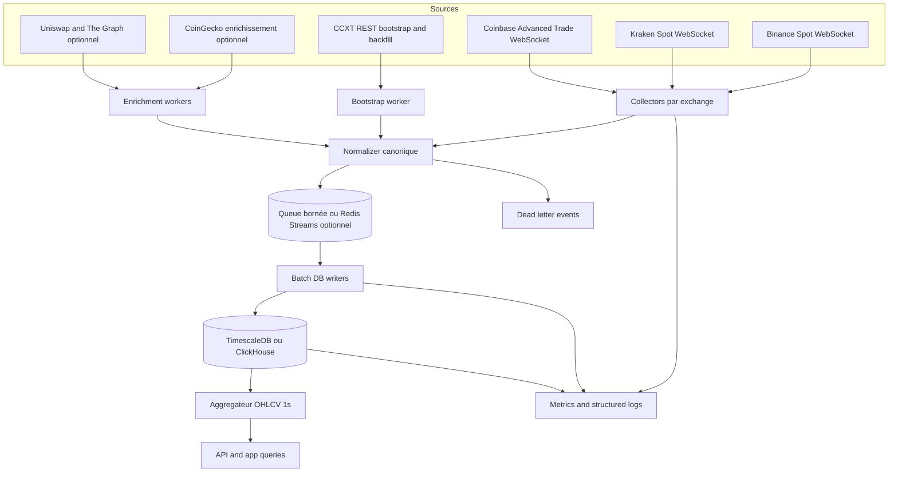

# Prompt intégral pour Antigravity sur une ingestion crypto temps réel en base

## Résumé exécutif

Pour une application qui doit ingérer de la donnée crypto en quasi temps réel avec un objectif d’environ une seconde, la stratégie la plus robuste n’est pas de “tout faire via REST”, mais d’utiliser les flux WebSocket natifs des exchanges pour le live, et CCXT uniquement pour le bootstrap, la découverte de marchés, la normalisation multi-exchange et les backfills REST. Binance Spot expose des flux `aggTrade` et `bookTicker` en temps réel, avec des contraintes explicites de ping/pong, une rotation forcée des connexions toutes les 24 heures, et jusqu’à 1024 streams par connexion. Kraken expose des flux `ticker`, `trade`, `book` et `instrument`, avec heartbeat automatique d’environ une seconde en absence d’updates. Coinbase Advanced Trade expose des canaux publics `heartbeats`, `ticker`, `market_trades` et `level2`, avec heartbeat toutes les secondes et un `level2` conçu pour maintenir un carnet cohérent. CCXT recommande `loadMarkets()` pour précharger les marchés, expose `fetchOHLCV`, et le support WebSocket anciennement “CCXT Pro” a été fusionné dans le package CCXT gratuit. citeturn13view0turn26view2turn26view3turn13view1turn15search11turn15search18turn20view0turn21view0turn14view4turn13view5turn19view0turn27view0turn27view1

Pour les enrichissements, CoinGecko est utile pour la métadonnée, les catégories, la market cap, les mappings d’IDs et les références cross-exchange, mais il ne doit pas être mis sur le chemin critique de l’ingestion CEX à 1 seconde. Leur WebSocket officiel est réservé aux plans payants, indiqué comme bêta, et explicitement exclu du SLA de la plateforme. Leur API publique sans clé est, elle, conçue pour du prototypage léger et soumise à des limites dynamiques. Pour l’on-chain/Dex, CoinGecko/GeckoTerminal fournit bien des flux `OnchainSimpleTokenPrice` pouvant aller “as fast as 1s” sur les tokens actifs, mais pour Uniswap, la documentation officielle prévient que les endpoints publics de subgraphs donnés en exemple ne sont pas des déploiements officiels Uniswap Labs et peuvent ne pas être activement maintenus ; en production, il faut plutôt auto-héberger son subgraph, utiliser The Graph avec un sink SQL, ou consommer directement l’on-chain. citeturn14view0turn14view1turn24view0turn13view3turn13view4turn12search1turn12search4

Côté base, le choix par défaut le plus équilibré pour un MVP sérieux est **PostgreSQL avec TimescaleDB** : hypertables pour la partition temporelle, politiques de rétention qui suppriment des chunks entiers, continuous aggregates pour les vues analytiques, et compression/columnstore pour les données plus anciennes. **ClickHouse** devient préférable dès que l’ingestion append-only et la volumétrie analytique deviennent dominantes, notamment si l’on active des flux L2 plus lourds ou si l’on vise des milliers de messages par seconde soutenus. **PostgreSQL “plain”** reste valable si le périmètre initial est petit et si l’on privilégie la simplicité opérationnelle, mais il demandera plus d’optimisation manuelle à la montée en charge. citeturn10search12turn14view6turn14view7turn10search13turn13view7turn13view8turn14view8turn23view0turn4search1turn4search0

En synthèse, la recommandation opérationnelle est la suivante : **phase initiale sur Binance Spot + Kraken Spot + Coinbase Advanced Trade, live natif WebSocket, bootstrap/backfill via CCXT, stockage TimescaleDB, dérivation OHLCV 1s, CoinGecko en enrichissement asynchrone, Uniswap en mode expérimental et hors SLA dur**. Les hypothèses de dimensionnement ci-dessous sont des hypothèses d’ingénierie pour cadrer le projet, à recalibrer après une semaine de capture réelle sur les marchés effectivement suivis.

## Comparatif des options de stockage

| Option | Quand la choisir | Avantages principaux | Inconvénients principaux | Recommandation |
|---|---|---|---|---|
| **PostgreSQL** | Périmètre initial réduit, équipe déjà très à l’aise en SQL/Postgres | Très simple à intégrer dans une app existante, transactions fortes, `jsonb` et index GIN utiles pour le debug et les payloads, ergonomie excellente | Partitionnement et time-series moins spécialisés que TimescaleDB, coût de tuning plus élevé quand le débit augmente | Bon choix si l’objectif est un MVP étroit |
| **TimescaleDB** | Choix par défaut pour un MVP sérieux temps réel + analytique | Hypertables, rétention par chunks, continuous aggregates, compression/columnstore, SQL/Postgres natif | Moins extrême que ClickHouse sur l’append-only massif, attention aux contraintes uniques sur hypertables | **Meilleur choix par défaut** |
| **ClickHouse** | Très forte volumétrie append-only, analytics lourdes, flux L2 étendus | `MergeTree`, partition pruning, très haut débit d’ingestion, bonne tenue sur gros historiques, `async_insert` possible | Modèle moins OLTP, mises à jour/sémantique d’idempotence plus subtiles, plus de discipline sur la forme des batches | À privilégier si l’on dépasse clairement le MVP CEX classique |

TimescaleDB est le meilleur compromis par défaut parce qu’il reste du PostgreSQL, tout en ajoutant le partitionnement temporel natif via hypertables, les politiques de rétention qui suppriment des chunks entiers plutôt que des millions de lignes, et des continuous aggregates rafraîchis en arrière-plan. PostgreSQL apporte par ailleurs `jsonb`, des index GIN adaptés aux recherches dans les documents, et les types `timestamptz` utiles pour des timestamps d’exchange cohérents en UTC. ClickHouse, de son côté, est explicitement conçu pour de forts débits d’ingestion avec des tables `MergeTree`; l’`async_insert` réduit la création excessive de parts, mais la documentation avertit que la déduplication automatique sûre des retries n’est pas activée par défaut en mode asynchrone, contrairement aux inserts synchrones idempotents sur `MergeTree`. citeturn10search12turn14view6turn14view7turn4search0turn4search2turn13view7turn13view8turn13view9turn23view0

En pratique, si l’équipe veut une première mise en production sobre, opérable et facile à brancher sur une app existante, **TimescaleDB** est le bon choix. Si, dans un second temps, l’objectif devient la conservation exhaustive de gros flux append-only, l’activation systématique de L2, ou l’analyse à très grande échelle, il faut préparer une abstraction d’écriture permettant d’ajouter **ClickHouse** sans réécrire les collecteurs.

## Prompt intégral pour Antigravity

Le prompt ci-dessous encode la stratégie recommandée par la documentation officielle : flux live via WebSockets natifs Binance/Kraken/Coinbase, bootstrap et backfill via CCXT, CoinGecko et Uniswap hors chemin critique de SLA dur, et stockage prioritaire en PostgreSQL/TimescaleDB avec possibilité d’adapter un writer ClickHouse ensuite. citeturn26view2turn26view3turn13view1turn15search11turn15search18turn21view0turn13view5turn19view0turn14view0turn13view4

```text
Tu es l’équipe/outil Antigravity en charge d’implémenter une nouvelle fonctionnalité dans notre application existante.

Je veux une implémentation incrémentale, PR-ready, maintenable et documentée d’une fonctionnalité d’ingestion temps réel de données crypto vers la base de données de l’application, avec un objectif opérationnel de fraîcheur de l’ordre de 1 seconde sur les données CEX critiques.

CONTEXTE ET OBJECTIF
- Ajouter à l’application existante une chaîne d’ingestion de market data crypto temps réel.
- Le but n’est PAS de construire un moteur de trading ni de gérer des ordres privés.
- Le but est de collecter, normaliser, persister, monitorer et rendre exploitable la donnée de marché.
- La fonctionnalité doit être activable par feature flag et déployable sans régression sur l’app existante.

PÉRIMÈTRE FONCTIONNEL
Je veux couvrir en priorité :
- marchés spot centralisés ;
- top of book / best bid-best ask ;
- trades temps réel ;
- OHLCV 1 seconde dérivé ;
- catalogue des marchés et métadonnées des symboles.

Le périmètre initial NE DOIT PAS dépendre d’API privées de trading.
Les flux privés/authentifiés éventuels doivent rester hors scope, sauf si une source en a besoin pour un test technique optionnel.

SOURCES À CONNECTER
Sources obligatoires prioritaires :
- Binance Spot :
  - WebSocket market streams pour le live ;
  - REST pour exchange info / bootstrap.
- Kraken Spot :
  - WebSocket v2 pour le live ;
  - REST market data / bootstrap.
- Coinbase Advanced Trade :
  - WebSocket market data public pour le live ;
  - REST products / bootstrap.
- CCXT :
  - discovery/normalisation des marchés ;
  - bootstrap des symboles ;
  - backfill OHLCV REST ;
  - fallback REST minimal si nécessaire.

Sources optionnelles derrière feature flags, hors chemin critique du SLA CEX :
- CoinGecko :
  - enrichissement metadata / catégories / market cap / mapping ;
  - ne pas rendre le hot path dépendant de CoinGecko.
- Uniswap / DEX :
  - voie expérimentale uniquement ;
  - utiliser une approche compatible production (subgraph auto-géré, sink SQL, ou worker dédié) ;
  - ne pas promettre le même SLA que pour les CEX sur cette brique.

CONTRAINTE D’ARCHITECTURE
Je veux l’architecture suivante :
- CCXT pour bootstrap / market catalog / backfill REST ;
- WebSockets natifs des exchanges pour le live ;
- un collector par exchange ;
- un normalizer vers un schéma canonique commun ;
- des workers séparés pour :
  - bootstrap des marchés,
  - collecte live,
  - agrégation 1s,
  - écriture batch en base,
  - enrichissement metadata,
  - monitoring/health.
- mécanismes de backpressure explicites ;
- idempotence explicite ;
- DLQ / dead-letter en cas d’erreur non récupérable ;
- journaux structurés ;
- metrics Prometheus-friendly.

CANONICAL DATA MODEL À IMPLÉMENTER
Je veux au minimum les objets canonisés suivants :
- exchange ;
- market (symbol, native_symbol, base, quote, statut, precision, active) ;
- trade_tick ;
- bbo_tick (best bid / best ask) ;
- ohlcv_1s ;
- ingestion_checkpoint ;
- dead_letter_event.

Chaque événement live doit être normalisé avec :
- source_exchange ;
- source_channel ;
- symbol canonique ;
- native_symbol ;
- event_time exchange ;
- ingest_time application ;
- event_uid stable pour idempotence ;
- payload brut conservé pour audit/debug.

FRÉQUENCE ET SLA / SLO INTERNES
Je veux les objectifs suivants pour les sources CEX prioritaires :
- fraîcheur cible : ~1 seconde ;
- p95 ingest lag (event_time exchange -> commit DB) < 2 secondes ;
- p99 ingest lag < 5 secondes ;
- reconnexion auto après incident réseau ou fermeture distante ;
- reprise automatique sans intervention humaine ;
- pas de perte silencieuse de messages ;
- toute perte, parse error ou write error doit être comptée et routée vers logs + métriques + DLQ si nécessaire.

Exclure explicitement CoinGecko et la voie DEX expérimentale du SLA dur du hot path CEX.

VOLUMES ESTIMÉS À PRENDRE EN COMPTE
Hypothèses de dimensionnement initial :
- 300 marchés actifs au total au démarrage ;
- priorité à 100 marchés par exchange sur 3 exchanges ;
- débits à supporter :
  - 1 000 messages/s soutenus sur le hot path en mono-noeud ;
  - 5 000 messages/s en burst court ;
- stockage initial :
  - trades bruts ;
  - BBO bruts ;
  - OHLCV 1s dérivé ;
- rétention cible :
  - trade_tick : 90 jours ;
  - bbo_tick : 30 jours ;
  - ohlcv_1s : 365 jours ;
  - metadata marchés : conservation longue ;
  - dead_letter_event : 30 jours minimum.
- prévoir que l’activation future d’un flux L2 complet augmente fortement le volume : cette capacité doit être feature-flagguée et non activée par défaut.

CHOIX DE STOCKAGE
Choix par défaut demandé :
- PostgreSQL / TimescaleDB si l’application a déjà PostgreSQL ou peut raisonnablement l’accepter.

Je veux aussi :
- une abstraction de writer pour permettre une alternative ClickHouse plus tard ;
- pas de couplage fort entre collecteurs et moteur de stockage.

Comportement d’écriture demandé :
- batch toutes les 250 ms ou toutes les 500/1000 lignes, selon le premier seuil atteint ;
- idempotence par event_uid ;
- si PostgreSQL :
  - utiliser UPSERT / ON CONFLICT DO NOTHING ou mécanisme équivalent ;
  - privilégier des écritures batch efficaces ;
  - si nécessaire, passer par table de staging puis merge.
- si ClickHouse est branché plus tard :
  - writer dédié, immutable append model.

BACKPRESSURE ET RÉSILIENCE
Je veux un mécanisme explicite de backpressure :
- files bornées ;
- métriques de profondeur de file ;
- stratégie de dégradation contrôlée ;
- ne jamais laisser CoinGecko/DEX bloquer le hot path CEX ;
- ne jamais perdre silencieusement des trades ;
- les événements non écrivables doivent aller en DLQ avec raison d’échec ;
- prévoir retry avec jitter / exponential backoff sur :
  - reconnect websocket ;
  - REST bootstrap ;
  - écritures DB temporaires si cohérent.

IDEMPOTENCE
Je veux une stratégie claire et lisible :
- event_uid stable dérivé de la source ;
- déduplication côté application + côté DB si possible ;
- retries sûrs ;
- absence de double écriture sur reconnexion ou replay partiel.

AGGRÉGATION 1S
Je veux produire des OHLCV 1 seconde à partir des trades ingérés en temps réel :
- bucket par exchange + symbol + seconde UTC ;
- open / high / low / close / volume_base / volume_quote / trade_count ;
- stratégie claire pour les secondes sans trade ;
- ne pas bloquer l’ingestion brute si l’agrégation échoue ;
- séparer clairement le flux brut et le flux agrégé.

MONITORING ET OBSERVABILITÉ
Je veux au minimum :
- health endpoint ;
- readiness / liveness ;
- métriques :
  - websocket_connected,
  - reconnect_total,
  - ingest_lag_ms,
  - db_write_lag_ms,
  - queue_depth,
  - batch_size,
  - rows_written_total,
  - rows_deduplicated_total,
  - parse_errors_total,
  - dlq_total,
  - bootstrap_duration_seconds ;
- logs JSON structurés avec correlation id / exchange / symbol / worker ;
- dashboard minimal Grafana ou équivalent ;
- alertes minimales :
  - plus de flux sur une source critique,
  - lag p95 > seuil,
  - profondeur de queue anormale,
  - échecs DB répétés,
  - taux d’erreur parse anormal.

SÉCURITÉ
Je veux la checklist sécurité appliquée dans le code et la doc :
- secrets jamais committés ;
- variables d’environnement ou secret manager ;
- rotation documentée ;
- moindres privilèges ;
- séparation des credentials par environnement ;
- pas de secret dans les logs ;
- chiffrement TLS pour les connexions externes et DB si disponible ;
- validation stricte des inputs ;
- protection contre dépassement de rate limits ;
- respect des Retry-After des fournisseurs ;
- feature flags pour les connecteurs optionnels ;
- audit minimal des changements de configuration.

TESTS REQUIS
Je veux :
- tests unitaires de normalisation ;
- tests unitaires de génération d’event_uid ;
- tests d’intégration DB ;
- tests d’intégration websocket ;
- tests de reconnexion ;
- tests de duplication / idempotence ;
- tests de charge avec scénarios réalistes ;
- simulation de ralentissement DB pour tester le backpressure ;
- replay de messages capturés pour vérifier stabilité du parseur.

SEUILS D’ACCEPTATION
La fonctionnalité sera considérée comme acceptée si :
- bootstrap marchés OK pour Binance / Kraken / Coinbase ;
- ingestion live active sur au moins BTC, ETH, SOL pour les 3 exchanges ;
- trades et bbo écrits en base ;
- OHLCV 1s dérivé disponible ;
- p95 ingest lag < 2 s en charge nominale ;
- reconnexion auto validée ;
- duplicate replay sans double écriture ;
- métriques exposées ;
- dashboard minimal fourni ;
- documentation runbook fournie ;
- migrations DB versionnées ;
- feature flags et variables d’environnement documentées ;
- aucun secret dans le repo ;
- tests CI passent.

LIVRABLES QUE J’ATTENDS DE TOI
Je veux que tu génères / modifies dans l’application existante :
- code des collecteurs ;
- code des normalizers ;
- code des writers DB ;
- migrations SQL ;
- configuration env ;
- docker-compose ou manifests minimaux si cohérent avec le repo ;
- tests ;
- documentation d’exploitation ;
- README d’activation ;
- exemple de dashboard/alert rules ;
- notes de limites connues ;
- plan de rollback.

IMPORTANT
- Ne réécris pas toute l’application.
- Intègre proprement dans la stack existante.
- Privilégie la lisibilité, la robustesse et l’observabilité.
- Le hot path CEX doit rester indépendant des enrichissements CoinGecko/DEX.
- L2 complet doit rester optionnel et désactivé par défaut.
- Si un choix doit être arbitré :
  - prioriser fiabilité > exhaustivité,
  - prioriser simplicité opérable > sophistication prématurée,
  - prioriser TimescaleDB pour le MVP sauf contrainte forte.
- Si certaines hypothèses doivent être précisées, implémente une version raisonnable et documente les TODO clairement.

FORMAT DE LA RÉPONSE ATTENDUE
Réponds comme un ingénieur principal qui livre un plan d’implémentation et le code :
- architecture cible ;
- arborescence des fichiers modifiés ;
- migrations ;
- snippets ou fichiers complets ;
- variables d’environnement ;
- plan de tests ;
- runbook ;
- limites connues.
```

## Schéma de base de données

Le schéma ci-dessous privilégie des timestamps UTC en `timestamptz`, une conservation du `payload` brut pour audit/debug, et une clé d’idempotence `event_uid` stable. Côté TimescaleDB, les contraintes uniques d’un hypertable doivent inclure la clé de partition temporelle ; c’est pourquoi les clés primaires proposées incluent `ts_event`. Le `jsonb` reste utile pour stocker le message natif et ouvrir la porte à des index GIN ciblés si nécessaire. Côté ClickHouse, la logique repose sur des tables append-only `MergeTree` ordonnées par `exchange_code`, `symbol`, `ts_event`, `event_uid`. citeturn22view0turn4search2turn4search0turn14view6turn13view7turn13view8turn13view9turn23view0

```sql
-- PostgreSQL / TimescaleDB
CREATE EXTENSION IF NOT EXISTS timescaledb;

CREATE TABLE IF NOT EXISTS exchange_ref (
    code            TEXT PRIMARY KEY,           -- 'binance', 'kraken', 'coinbase'
    name            TEXT NOT NULL,
    venue_type      TEXT NOT NULL DEFAULT 'cex',
    enabled         BOOLEAN NOT NULL DEFAULT TRUE,
    created_at      TIMESTAMPTZ NOT NULL DEFAULT now()
);

CREATE TABLE IF NOT EXISTS market_ref (
    id              BIGSERIAL PRIMARY KEY,
    exchange_code   TEXT NOT NULL REFERENCES exchange_ref(code),
    symbol          TEXT NOT NULL,              -- canonique, ex: BTC/USDT
    native_symbol   TEXT NOT NULL,              -- ex: BTCUSDT / XBT/USD / BTC-USD
    base_asset      TEXT NOT NULL,
    quote_asset     TEXT NOT NULL,
    market_type     TEXT NOT NULL DEFAULT 'spot',
    status          TEXT,
    active          BOOLEAN NOT NULL DEFAULT TRUE,
    price_precision INTEGER,
    qty_precision   INTEGER,
    meta            JSONB NOT NULL DEFAULT '{}'::jsonb,
    updated_at      TIMESTAMPTZ NOT NULL DEFAULT now(),
    UNIQUE (exchange_code, native_symbol),
    UNIQUE (exchange_code, symbol)
);

CREATE TABLE IF NOT EXISTS trade_tick (
    ts_event        TIMESTAMPTZ NOT NULL,
    ts_ingested     TIMESTAMPTZ NOT NULL DEFAULT now(),
    exchange_code   TEXT NOT NULL REFERENCES exchange_ref(code),
    symbol          TEXT NOT NULL,
    native_symbol   TEXT NOT NULL,
    source_channel  TEXT NOT NULL,             -- aggTrade / trade / market_trades / ...
    event_uid       TEXT NOT NULL,             -- clé idempotente stable
    source_sequence BIGINT,
    trade_id        TEXT,
    side            TEXT NOT NULL DEFAULT 'unknown',
    price           NUMERIC(38, 18) NOT NULL,
    qty             NUMERIC(38, 18) NOT NULL,
    quote_qty       NUMERIC(38, 18),
    is_maker        BOOLEAN,
    payload         JSONB NOT NULL,
    PRIMARY KEY (ts_event, exchange_code, symbol, event_uid)
);

CREATE TABLE IF NOT EXISTS bbo_tick (
    ts_event        TIMESTAMPTZ NOT NULL,
    ts_ingested     TIMESTAMPTZ NOT NULL DEFAULT now(),
    exchange_code   TEXT NOT NULL REFERENCES exchange_ref(code),
    symbol          TEXT NOT NULL,
    native_symbol   TEXT NOT NULL,
    source_channel  TEXT NOT NULL,             -- bookTicker / ticker / level2_top / ...
    event_uid       TEXT NOT NULL,
    source_sequence BIGINT,
    bid_px          NUMERIC(38, 18) NOT NULL,
    bid_qty         NUMERIC(38, 18) NOT NULL,
    ask_px          NUMERIC(38, 18) NOT NULL,
    ask_qty         NUMERIC(38, 18) NOT NULL,
    payload         JSONB NOT NULL,
    PRIMARY KEY (ts_event, exchange_code, symbol, event_uid)
);

CREATE TABLE IF NOT EXISTS ohlcv_1s (
    bucket_start    TIMESTAMPTZ NOT NULL,
    exchange_code   TEXT NOT NULL REFERENCES exchange_ref(code),
    symbol          TEXT NOT NULL,
    native_symbol   TEXT NOT NULL,
    open            NUMERIC(38, 18) NOT NULL,
    high            NUMERIC(38, 18) NOT NULL,
    low             NUMERIC(38, 18) NOT NULL,
    close           NUMERIC(38, 18) NOT NULL,
    volume_base     NUMERIC(38, 18) NOT NULL DEFAULT 0,
    volume_quote    NUMERIC(38, 18) NOT NULL DEFAULT 0,
    trade_count     INTEGER NOT NULL DEFAULT 0,
    source          TEXT NOT NULL DEFAULT 'derived_trades',
    updated_at      TIMESTAMPTZ NOT NULL DEFAULT now(),
    PRIMARY KEY (bucket_start, exchange_code, symbol)
);

CREATE TABLE IF NOT EXISTS ingestion_checkpoint (
    collector_name      TEXT NOT NULL,         -- ex: binance-trades-shard-01
    shard_id            TEXT NOT NULL,
    cursor_text         TEXT,
    last_event_time     TIMESTAMPTZ,
    last_commit_time    TIMESTAMPTZ,
    updated_at          TIMESTAMPTZ NOT NULL DEFAULT now(),
    PRIMARY KEY (collector_name, shard_id)
);

CREATE TABLE IF NOT EXISTS dead_letter_event (
    id                  BIGSERIAL PRIMARY KEY,
    created_at          TIMESTAMPTZ NOT NULL DEFAULT now(),
    exchange_code       TEXT,
    symbol              TEXT,
    source_channel      TEXT,
    event_uid           TEXT,
    error_class         TEXT NOT NULL,
    error_message       TEXT NOT NULL,
    raw_payload         JSONB NOT NULL,
    resolved            BOOLEAN NOT NULL DEFAULT FALSE
);

SELECT create_hypertable('trade_tick', 'ts_event',
    if_not_exists => TRUE,
    chunk_time_interval => INTERVAL '1 day');

SELECT create_hypertable('bbo_tick', 'ts_event',
    if_not_exists => TRUE,
    chunk_time_interval => INTERVAL '1 day');

SELECT create_hypertable('ohlcv_1s', 'bucket_start',
    if_not_exists => TRUE,
    chunk_time_interval => INTERVAL '7 days');

CREATE INDEX IF NOT EXISTS idx_trade_tick_exchange_symbol_ts
    ON trade_tick (exchange_code, symbol, ts_event DESC);

CREATE INDEX IF NOT EXISTS idx_bbo_tick_exchange_symbol_ts
    ON bbo_tick (exchange_code, symbol, ts_event DESC);

CREATE INDEX IF NOT EXISTS idx_ohlcv_1s_exchange_symbol_ts
    ON ohlcv_1s (exchange_code, symbol, bucket_start DESC);

CREATE INDEX IF NOT EXISTS idx_trade_tick_payload_gin
    ON trade_tick USING GIN (payload jsonb_path_ops);

CREATE INDEX IF NOT EXISTS idx_dead_letter_created_at
    ON dead_letter_event (created_at DESC);

-- Politiques de rétention conseillées
SELECT add_retention_policy('trade_tick', INTERVAL '90 days', if_not_exists => TRUE);
SELECT add_retention_policy('bbo_tick', INTERVAL '30 days', if_not_exists => TRUE);
SELECT add_retention_policy('ohlcv_1s', INTERVAL '365 days', if_not_exists => TRUE);
```

```sql
-- Exemples de lignes PostgreSQL / TimescaleDB
INSERT INTO exchange_ref (code, name, venue_type)
VALUES
  ('binance', 'Binance Spot', 'cex'),
  ('kraken', 'Kraken Spot', 'cex'),
  ('coinbase', 'Coinbase Advanced Trade', 'cex')
ON CONFLICT DO NOTHING;

INSERT INTO market_ref (
    exchange_code, symbol, native_symbol, base_asset, quote_asset,
    market_type, status, active, price_precision, qty_precision, meta
) VALUES (
    'binance', 'BTC/USDT', 'BTCUSDT', 'BTC', 'USDT',
    'spot', 'TRADING', TRUE, 2, 6,
    '{"source":"ccxt","status":"TRADING"}'::jsonb
) ON CONFLICT DO NOTHING;

INSERT INTO trade_tick (
    ts_event, exchange_code, symbol, native_symbol, source_channel,
    event_uid, trade_id, side, price, qty, quote_qty, is_maker, payload
) VALUES (
    '2026-06-06T09:00:00.123Z', 'binance', 'BTC/USDT', 'BTCUSDT', 'aggTrade',
    'binance:BTCUSDT:aggTrade:12345:2026-06-06T09:00:00.123Z',
    '12345', 'sell', 68500.120000000000000000, 0.015000000000000000, 1027.501800000000000000, TRUE,
    '{"e":"aggTrade","a":12345,"p":"68500.12","q":"0.015"}'::jsonb
);

INSERT INTO bbo_tick (
    ts_event, exchange_code, symbol, native_symbol, source_channel,
    event_uid, bid_px, bid_qty, ask_px, ask_qty, payload
) VALUES (
    '2026-06-06T09:00:00.124Z', 'binance', 'BTC/USDT', 'BTCUSDT', 'bookTicker',
    'binance:BTCUSDT:bookTicker:400900217',
    68500.110000000000000000, 0.450000000000000000, 68500.120000000000000000, 0.380000000000000000,
    '{"u":400900217,"b":"68500.11","B":"0.45","a":"68500.12","A":"0.38"}'::jsonb
);
```

```sql
-- Requêtes PostgreSQL / TimescaleDB utiles

-- Dernier BBO par exchange et symbole
SELECT DISTINCT ON (exchange_code, symbol)
    exchange_code, symbol, ts_event, bid_px, ask_px
FROM bbo_tick
WHERE ts_event >= now() - INTERVAL '10 minutes'
ORDER BY exchange_code, symbol, ts_event DESC;

-- Dernières bougies 1s sur BTC/USDT
SELECT bucket_start, open, high, low, close, volume_base, trade_count
FROM ohlcv_1s
WHERE exchange_code = 'binance'
  AND symbol = 'BTC/USDT'
  AND bucket_start >= now() - INTERVAL '1 minute'
ORDER BY bucket_start;

-- Latence applicative simple
SELECT exchange_code,
       max(ts_ingested - ts_event) AS worst_lag,
       avg(ts_ingested - ts_event) AS avg_lag
FROM trade_tick
WHERE ts_event >= now() - INTERVAL '5 minutes'
GROUP BY exchange_code;
```

Pour une alternative ClickHouse, il faut garder le modèle append-only et, si l’on veut bénéficier des retries idempotents les plus simples, préférer des inserts synchrones cohérents ou, si l’on active `async_insert`, le faire avec `wait_for_async_insert=1` et une politique claire de batches stables. La doc ClickHouse insiste sur le fait que les inserts synchrones `MergeTree` sont idempotents par défaut à batch identique, alors que la déduplication automatique n’est pas activée par défaut pour les inserts asynchrones. citeturn13view9turn14view8turn23view0

```sql
-- ClickHouse
CREATE TABLE IF NOT EXISTS exchange_ref
(
    code        LowCardinality(String),
    name        String,
    venue_type  LowCardinality(String),
    enabled     Bool,
    created_at  DateTime64(3, 'UTC')
)
ENGINE = MergeTree
ORDER BY code;

CREATE TABLE IF NOT EXISTS market_ref
(
    exchange_code   LowCardinality(String),
    symbol          LowCardinality(String),
    native_symbol   String,
    base_asset      LowCardinality(String),
    quote_asset     LowCardinality(String),
    market_type     LowCardinality(String),
    status          String,
    active          Bool,
    price_precision UInt16,
    qty_precision   UInt16,
    meta            String,
    updated_at      DateTime64(3, 'UTC')
)
ENGINE = MergeTree
ORDER BY (exchange_code, symbol);

CREATE TABLE IF NOT EXISTS trade_tick
(
    ts_event        DateTime64(3, 'UTC'),
    ts_ingested     DateTime64(3, 'UTC'),
    exchange_code   LowCardinality(String),
    symbol          LowCardinality(String),
    native_symbol   String,
    source_channel  LowCardinality(String),
    event_uid       String,
    source_sequence Nullable(Int64),
    trade_id        Nullable(String),
    side            Enum8('unknown' = 0, 'buy' = 1, 'sell' = 2),
    price           Decimal(38, 18),
    qty             Decimal(38, 18),
    quote_qty       Nullable(Decimal(38, 18)),
    is_maker        Nullable(Bool),
    payload         String
)
ENGINE = MergeTree
PARTITION BY toYYYYMMDD(ts_event)
ORDER BY (exchange_code, symbol, ts_event, event_uid);

CREATE TABLE IF NOT EXISTS bbo_tick
(
    ts_event        DateTime64(3, 'UTC'),
    ts_ingested     DateTime64(3, 'UTC'),
    exchange_code   LowCardinality(String),
    symbol          LowCardinality(String),
    native_symbol   String,
    source_channel  LowCardinality(String),
    event_uid       String,
    source_sequence Nullable(Int64),
    bid_px          Decimal(38, 18),
    bid_qty         Decimal(38, 18),
    ask_px          Decimal(38, 18),
    ask_qty         Decimal(38, 18),
    payload         String
)
ENGINE = MergeTree
PARTITION BY toYYYYMMDD(ts_event)
ORDER BY (exchange_code, symbol, ts_event, event_uid);

CREATE TABLE IF NOT EXISTS ohlcv_1s
(
    bucket_start    DateTime64(3, 'UTC'),
    exchange_code   LowCardinality(String),
    symbol          LowCardinality(String),
    native_symbol   String,
    open            Decimal(38, 18),
    high            Decimal(38, 18),
    low             Decimal(38, 18),
    close           Decimal(38, 18),
    volume_base     Decimal(38, 18),
    volume_quote    Decimal(38, 18),
    trade_count     UInt32,
    source          LowCardinality(String),
    updated_at      DateTime64(3, 'UTC')
)
ENGINE = MergeTree
PARTITION BY toYYYYMM(bucket_start)
ORDER BY (exchange_code, symbol, bucket_start);

CREATE TABLE IF NOT EXISTS ingestion_checkpoint
(
    collector_name      String,
    shard_id            String,
    cursor_text         Nullable(String),
    last_event_time     Nullable(DateTime64(3, 'UTC')),
    last_commit_time    Nullable(DateTime64(3, 'UTC')),
    updated_at          DateTime64(3, 'UTC')
)
ENGINE = ReplacingMergeTree(updated_at)
ORDER BY (collector_name, shard_id);

CREATE TABLE IF NOT EXISTS dead_letter_event
(
    created_at      DateTime64(3, 'UTC'),
    exchange_code   Nullable(LowCardinality(String)),
    symbol          Nullable(LowCardinality(String)),
    source_channel  Nullable(LowCardinality(String)),
    event_uid       Nullable(String),
    error_class     String,
    error_message   String,
    raw_payload     String,
    resolved        Bool
)
ENGINE = MergeTree
PARTITION BY toYYYYMM(created_at)
ORDER BY (created_at, error_class);
```

```sql
-- Requête ClickHouse utile : dernière valeur par exchange
SELECT
    exchange_code,
    argMax(price, ts_event) AS last_price,
    max(ts_event) AS last_ts
FROM trade_tick
WHERE symbol = 'BTC/USDT'
  AND ts_event >= now() - INTERVAL 5 MINUTE
GROUP BY exchange_code
ORDER BY exchange_code;
```

## Architecture d’ingestion

L’architecture d’ingestion doit être pilotée par les sémantiques réelles de chaque venue, pas par une abstraction naïve “une connexion = toutes les données”. Binance Spot force une rotation des connexions WebSocket toutes les 24 heures, envoie un ping toutes les 20 secondes, limite les messages entrants côté client à 5/s sur une connexion, et autorise jusqu’à 1024 streams par socket. Kraken v2 fournit un heartbeat automatique d’environ une seconde quand les canaux sont silencieux et expose un flux `instrument` pour la référence des actifs et paires actives. Coinbase impose un `subscribe` dans les 5 secondes, recommande explicitement le canal `heartbeats` pour éviter la fermeture des canaux inactifs, et son `level2` garantit la livraison des updates pour maintenir le carnet. citeturn13view0turn1search1turn15search18turn20view0turn21view0

Dans cette architecture, **les WebSockets natifs restent le hot path**, tandis que **CCXT** sert au bootstrap du catalogue marchés, aux refreshs périodiques des métadonnées, et au backfill OHLCV REST. Les enrichissements CoinGecko et Uniswap ne doivent pas retarder les commits des `trade_tick` et `bbo_tick`. L’idempotence est portée par un `event_uid` stable dérivé des identifiants natifs disponibles (`trade_id`, `aggTrade id`, `updateId`, `sequence_num`, etc.), et le writer base applique une écriture dédupliquée. En ClickHouse, les retries sûrs exigent des batches identiques ; en mode asynchrone, la déduplication n’est pas “gratuite” par défaut, donc il faut la traiter comme une décision d’architecture, pas un détail d’implémentation. citeturn26view3turn26view2turn13view5turn27view0turn27view1turn14view8turn23view0



Un découpage minimal et robuste ressemble à ceci : un **bootstrap worker** charge les marchés via CCXT (`loadMarkets`), alimente `market_ref`, et exécute les backfills OHLCV REST si nécessaire ; des **collectors par exchange** maintiennent les sockets, les resubscriptions et les reconnections ; un **normalizer** traduit chaque message natif en événements canoniques ; une **queue bornée** absorbe les bursts et matérialise la backpressure ; un **batch writer** commit en base toutes les 250 ms ou à seuil de lignes ; un **aggregateur 1s** dérive `ohlcv_1s` depuis `trade_tick`; et un **DLQ** capture les payloads non parseables ou non écrits. Cette séparation permet de couper les enrichissements sans jamais sacrifier le flux critique CEX.

## Déploiement minimal

Pour un déploiement minimal, un **VPS unique** avec conteneurs suffit pour le MVP si le périmètre reste raisonnable : `app-backend`, `ingestor`, `postgres/timescale`, `redis` optionnel, `prometheus`, `grafana`, et un reverse proxy si nécessaire. Pour un POC/mini-prod en Europe, une VM de type **Hetzner CAX21** offre 4 vCPU, 8 Go de RAM et 80 Go de disque pour **7,99 € / mois** ; le plan **CAX31** monte à 8 vCPU, 16 Go et 160 Go pour **15,99 € / mois** ; le **CAX41** monte à 16 vCPU, 32 Go et 320 Go pour **31,49 € / mois**. En alternative plus “premium” mais plus chère, DigitalOcean affiche **4 Go / 2 vCPU / 80 Go à 24 $ / mois**, **8 Go / 4 vCPU / 160 Go à 48 $ / mois**, et **16 Go / 8 vCPU / 320 Go à 96 $ / mois**. citeturn17view0turn17view1turn18search1turn18search2

| Profil | Usage visé | CPU | RAM | Disque | Base recommandée | Prix serveur indicatif |
|---|---|---:|---:|---:|---|---|
| **MVP raisonnable** | ~300 marchés, trades + BBO + OHLCV 1s, sans L2 complet | 4 vCPU | 8 Go | 80 Go NVMe | TimescaleDB | Hetzner CAX21 : 7,99 € / mois citeturn17view0turn17view1 |
| **MVP robuste** | + bursts plus fréquents, monitoring complet, marge d’exploitation | 8 vCPU | 16 Go | 160 Go NVMe | TimescaleDB | Hetzner CAX31 : 15,99 € / mois citeturn17view0turn17view1 |
| **Analytics lourde** | gros append-only, L2 optionnel, historique plus dense | 16 vCPU | 32 Go | 320 Go NVMe | ClickHouse ou TimescaleDB séparé | Hetzner CAX41 : 31,49 € / mois citeturn17view0turn17view1 |
| **Alternative cloud simple** | équipe déjà sur DigitalOcean | 4–8 vCPU équiv. | 8–16 Go | 160–320 Go | TimescaleDB ou ClickHouse | DO : 48–96 $ / mois citeturn18search1turn18search2 |

En budget total à prévoir, il faut ajouter au “server-only” un peu de marge pour les snapshots/backups, le stockage de logs, et éventuellement un petit stockage objet externe. Un budget réaliste de départ est donc plutôt **15 à 30 € / mois** pour un MVP très sobre sur un hébergeur budget, et **25 à 50 € / mois** dès qu’on ajoute des sauvegardes sérieuses et un monitoring persistant. Ce sont des estimations d’ingénierie, non des prix catalogue de services managés.

Le plan de déploiement minimal recommandé est le suivant : **une seule VM**, volumes persistants pour la base et les métriques, `docker compose` ou équivalent, sauvegarde quotidienne logique + rotation, et runbook simple pour rotation des collecteurs, redémarrage ordonné, et restauration de la base. Si l’on choisit ClickHouse, il vaut mieux séparer le moteur analytique de l’application dès que les flux dépassent le MVP.

## Scripts Python d’exemple

Les exemples ci-dessous supposent une stratégie conforme aux docs officielles : **CCXT pour charger le catalogue marchés**, puis **WebSocket natif Binance** pour le live, avec batch insert en PostgreSQL. CCXT recommande explicitement `loadMarkets()` comme méthode standard de préchargement des marchés et expose `fetchOHLCV`; Binance Spot documente bien `aggTrade` et `bookTicker` en temps réel. citeturn27view0turn27view1turn26view2turn26view3

```python
# seed_markets.py
# pip install ccxt psycopg2-binary

import os
import json
import ccxt
import psycopg2
from psycopg2.extras import execute_values

DATABASE_URL = os.environ["DATABASE_URL"]
EXCHANGES = ["binance", "kraken", "coinbase"]


def canonical_symbol(market: dict) -> str:
    # CCXT renvoie déjà un symbol canonique de type BTC/USDT
    return market["symbol"]


def precision_to_int(value):
    if value is None:
        return None
    try:
        return int(value)
    except Exception:
        return None


def upsert_markets(conn, exchange_code: str, markets: dict) -> None:
    rows = []
    for _, m in markets.items():
        base = m.get("base")
        quote = m.get("quote")
        if not base or not quote:
            continue

        rows.append((
            exchange_code,
            canonical_symbol(m),
            m.get("id") or m.get("symbol"),
            base,
            quote,
            m.get("type") or "spot",
            "ACTIVE" if m.get("active", True) else "INACTIVE",
            bool(m.get("active", True)),
            precision_to_int((m.get("precision") or {}).get("price")),
            precision_to_int((m.get("precision") or {}).get("amount")),
            json.dumps({
                "limits": m.get("limits"),
                "precision": m.get("precision"),
                "taker": m.get("taker"),
                "maker": m.get("maker"),
                "raw": m.get("info"),
            }),
        ))

    with conn.cursor() as cur:
        execute_values(
            cur,
            """
            INSERT INTO market_ref (
                exchange_code, symbol, native_symbol, base_asset, quote_asset,
                market_type, status, active, price_precision, qty_precision, meta
            ) VALUES %s
            ON CONFLICT (exchange_code, native_symbol)
            DO UPDATE SET
                symbol = EXCLUDED.symbol,
                base_asset = EXCLUDED.base_asset,
                quote_asset = EXCLUDED.quote_asset,
                market_type = EXCLUDED.market_type,
                status = EXCLUDED.status,
                active = EXCLUDED.active,
                price_precision = EXCLUDED.price_precision,
                qty_precision = EXCLUDED.qty_precision,
                meta = EXCLUDED.meta,
                updated_at = now();
            """,
            rows,
            page_size=500,
        )
    conn.commit()


def main():
    conn = psycopg2.connect(DATABASE_URL)
    try:
        with conn.cursor() as cur:
            cur.execute("""
                INSERT INTO exchange_ref (code, name, venue_type)
                VALUES
                    ('binance', 'Binance Spot', 'cex'),
                    ('kraken', 'Kraken Spot', 'cex'),
                    ('coinbase', 'Coinbase Advanced Trade', 'cex')
                ON CONFLICT DO NOTHING;
            """)
            conn.commit()

        for ex_id in EXCHANGES:
            exchange_cls = getattr(ccxt, ex_id)
            exchange = exchange_cls({"enableRateLimit": True})
            markets = exchange.load_markets()
            upsert_markets(conn, ex_id, markets)
            print(f"{ex_id}: {len(markets)} marchés synchronisés")
    finally:
        conn.close()


if __name__ == "__main__":
    main()
```

```python
# binance_ws_ingest.py
# pip install websockets psycopg2-binary

import os
import json
import time
import queue
import threading
from decimal import Decimal
from datetime import datetime, timezone

import psycopg2
from psycopg2.extras import execute_values
import websocket  # websocket-client

DATABASE_URL = os.environ["DATABASE_URL"]

BINANCE_WS_URL = "wss://stream.binance.com:9443/ws"
SYMBOLS = ["btcusdt", "ethusdt", "solusdt"]
BATCH_MAX_ROWS = 1000
FLUSH_EVERY_SECONDS = 0.25

trade_queue = queue.Queue(maxsize=50000)
bbo_queue = queue.Queue(maxsize=50000)


def utc_now():
    return datetime.now(timezone.utc)


def ms_to_dt(ms: int) -> datetime:
    return datetime.fromtimestamp(ms / 1000.0, tz=timezone.utc)


def trade_event_uid(msg: dict) -> str:
    # Stable enough for retries on Binance aggTrade
    return f"binance:{msg['s']}:aggTrade:{msg['a']}:{msg['T']}"


def bbo_event_uid(msg: dict) -> str:
    return f"binance:{msg['s']}:bookTicker:{msg['u']}"


def normalize_trade(msg: dict):
    return (
        ms_to_dt(msg["T"]),
        utc_now(),
        "binance",
        ccxt_symbol_from_binance(msg["s"]),
        msg["s"],
        "aggTrade",
        trade_event_uid(msg),
        None,                      # source_sequence
        str(msg["a"]),             # trade_id
        "sell" if msg.get("m") else "buy",
        Decimal(msg["p"]),
        Decimal(msg["q"]),
        Decimal(msg["p"]) * Decimal(msg["q"]),
        bool(msg.get("m")),
        json.dumps(msg),
    )


def normalize_bbo(msg: dict):
    event_ms = int(time.time() * 1000)  # bookTicker Spot n'expose pas toujours E
    return (
        ms_to_dt(event_ms),
        utc_now(),
        "binance",
        ccxt_symbol_from_binance(msg["s"]),
        msg["s"],
        "bookTicker",
        bbo_event_uid(msg),
        int(msg["u"]),
        Decimal(msg["b"]),
        Decimal(msg["B"]),
        Decimal(msg["a"]),
        Decimal(msg["A"]),
        json.dumps(msg),
    )


def ccxt_symbol_from_binance(native_symbol: str) -> str:
    # MVP simple: supposons des quotes connues
    known_quotes = ["USDT", "USDC", "BTC", "ETH", "EUR", "FDUSD", "TRY", "BRL"]
    for quote in known_quotes:
        if native_symbol.endswith(quote):
            base = native_symbol[:-len(quote)]
            return f"{base}/{quote}"
    return native_symbol


def flush_trades(conn, rows):
    if not rows:
        return
    with conn.cursor() as cur:
        execute_values(
            cur,
            """
            INSERT INTO trade_tick (
                ts_event, ts_ingested, exchange_code, symbol, native_symbol,
                source_channel, event_uid, source_sequence, trade_id, side,
                price, qty, quote_qty, is_maker, payload
            ) VALUES %s
            ON CONFLICT DO NOTHING;
            """,
            rows,
            page_size=1000,
        )


def flush_bbo(conn, rows):
    if not rows:
        return
    with conn.cursor() as cur:
        execute_values(
            cur,
            """
            INSERT INTO bbo_tick (
                ts_event, ts_ingested, exchange_code, symbol, native_symbol,
                source_channel, event_uid, source_sequence,
                bid_px, bid_qty, ask_px, ask_qty, payload
            ) VALUES %s
            ON CONFLICT DO NOTHING;
            """,
            rows,
            page_size=1000,
        )


def db_writer():
    conn = psycopg2.connect(DATABASE_URL)
    conn.autocommit = False
    last_flush = time.time()
    trades, bbos = [], []

    try:
        while True:
            now = time.time()

            # Drain queues opportunistically
            while len(trades) < BATCH_MAX_ROWS:
                try:
                    trades.append(trade_queue.get_nowait())
                except queue.Empty:
                    break

            while len(bbos) < BATCH_MAX_ROWS:
                try:
                    bbos.append(bbo_queue.get_nowait())
                except queue.Empty:
                    break

            should_flush = (
                len(trades) >= BATCH_MAX_ROWS
                or len(bbos) >= BATCH_MAX_ROWS
                or (now - last_flush) >= FLUSH_EVERY_SECONDS
            )

            if should_flush and (trades or bbos):
                try:
                    flush_trades(conn, trades)
                    flush_bbo(conn, bbos)
                    conn.commit()
                    trades.clear()
                    bbos.clear()
                    last_flush = now
                except Exception as exc:
                    conn.rollback()
                    print(f"[DB] rollback after error: {exc}")
                    time.sleep(1.0)

            time.sleep(0.01)
    finally:
        conn.close()


def on_open(ws):
    params = []
    for s in SYMBOLS:
        params.append(f"{s}@aggTrade")
        params.append(f"{s}@bookTicker")

    payload = {
        "method": "SUBSCRIBE",
        "params": params,
        "id": 1,
    }
    ws.send(json.dumps(payload))
    print("[WS] subscribed")


def on_message(ws, message):
    msg = json.loads(message)
    event_type = msg.get("e")

    try:
        if event_type == "aggTrade":
            trade_queue.put_nowait(normalize_trade(msg))
        elif "u" in msg and "b" in msg and "a" in msg and "B" in msg and "A" in msg:
            bbo_queue.put_nowait(normalize_bbo(msg))
    except queue.Full:
        # En prod : incrémenter métrique + alterner avec spool/DLQ contrôlé
        print("[WARN] queue full; event dropped from live process")


def on_error(ws, error):
    print(f"[WS] error: {error}")


def on_close(ws, status_code, close_msg):
    print(f"[WS] closed: code={status_code}, msg={close_msg}")


def run_ws_forever():
    while True:
        try:
            ws = websocket.WebSocketApp(
                BINANCE_WS_URL,
                on_open=on_open,
                on_message=on_message,
                on_error=on_error,
                on_close=on_close,
            )
            ws.run_forever(ping_interval=15, ping_timeout=10)
        except Exception as exc:
            print(f"[WS] reconnect after exception: {exc}")
        time.sleep(2)


if __name__ == "__main__":
    writer_thread = threading.Thread(target=db_writer, daemon=True)
    writer_thread.start()
    run_ws_forever()
```

Le script ci-dessus illustre le cœur du pattern attendu : **abonnement multiple**, **normalisation canonique**, **queue bornée**, **batch insert**, **idempotence via `event_uid`**, et **reconnexion infinie**. En production, deux améliorations sont fortement souhaitables : d’une part, un vrai mécanisme DLQ/spool pour les cas de `queue.Full` au lieu d’un simple drop ; d’autre part, un agrégateur 1 seconde séparé, qui consomme `trade_tick` et produit `ohlcv_1s` sans bloquer l’ingestion brute.

## Tests, validation et sécurité

Les scénarios de validation doivent refléter les comportements explicitement documentés des fournisseurs. Binance force une rotation de connexion à 24 h avec ping/pong régulier ; Coinbase demande une souscription dans les 5 secondes et recommande le canal `heartbeats` parce que plusieurs canaux se ferment après 60–90 secondes sans activité ; Kraken envoie un heartbeat automatique en absence d’updates. Les tests doivent donc vérifier non seulement la charge nominale, mais aussi la résilience à ces comportements attendus. citeturn13view0turn20view0turn21view0turn1search1

| Scénario | Ce qu’il faut simuler | Seuil cible |
|---|---|---|
| **Charge nominale** | ~1 000 messages/s soutenus, 300 marchés actifs, writer DB nominal | `p95 ingest lag < 2 s`, `p99 < 5 s` |
| **Burst court** | ~5 000 messages/s pendant plusieurs minutes | pas de crash, queue bornée, retour à l’équilibre en moins de 10 min |
| **Rotation Binance** | fermeture/reconnexion planifiée | reprise automatique sans intervention, perte silencieuse = 0 |
| **Idle Coinbase** | marchés peu liquides avec heartbeat activé | aucune fermeture inattendue des channels suivis |
| **Ralentissement DB** | latence d’écriture multipliée par 3 | backpressure visible, hot path encore vivant, DLQ si nécessaire |
| **Replay de doublons** | renvoi des mêmes batches / messages | aucune double écriture observable |
| **Erreur parseur** | messages malformés / schéma inattendu | l’ingestor continue, événement routé vers DLQ |
| **Backfill CCXT** | chargement marchés + OHLCV | respect des limites, pas de tempête REST |

La checklist sécurité minimale doit être appliquée dès le MVP :

- **Par défaut, n’utiliser que des endpoints publics de market data.** Les API keys ne doivent être introduites que si une source optionnelle les exige réellement. Coinbase explique que l’authentification WebSocket repose sur un JWT qui expire après 2 minutes ; Kraken demande un token WebSocket dérivé du REST pour les canaux authentifiés, à utiliser dans les 15 minutes ; CoinGecko expose des mécanismes de suivi de consommation et de révocation de clé. citeturn20view1turn20view2turn20view3  
- **Respect strict des limites et du backoff fournisseur.** Binance renvoie `429`, fournit `Retry-After`, et escalade jusqu’à `418` en cas d’abus répété ; Coinbase limite certaines actions WebSocket à 8/s par IP ; CoinGecko rappelle que l’API publique est destinée au prototypage léger et que le plan demo tourne autour de 30 appels/minute. citeturn14view2turn14view4turn14view1turn24view0  
- **Secrets hors dépôt**, injection par variables d’environnement ou secret manager, pas de secrets dans les logs, rotation documentée, séparation des creds par environnement, et jeux de permissions minimales côté base et côté connecteurs.  
- **Chiffrement et cloisonnement basiques** : TLS partout où disponible, réseau interne entre app et DB si possible, sauvegardes chiffrées, audit des changements de configuration, et accès SSH restreint.  
- **Conformité** : en absence d’exigence réglementaire spécifique, traiter le périmètre comme de la donnée de marché publique. Ne pas introduire de flux de trading, d’ordres privés ou de PII dans cette fonctionnalité.

Le monitoring minimal doit enfin exposer une vision exploitable : `ingest_lag_ms`, `queue_depth`, `rows_written_total`, `rows_deduplicated_total`, `parse_errors_total`, `reconnect_total`, et un état par exchange/shard/worker. Si un seul tableau de bord existe au départ, il doit au minimum permettre de répondre rapidement à quatre questions : **est-ce que les sockets sont vivants, est-ce que la DB suit, est-ce que la fraîcheur reste sous contrôle, et est-ce que l’on perd ou déduplique trop d’événements ?**