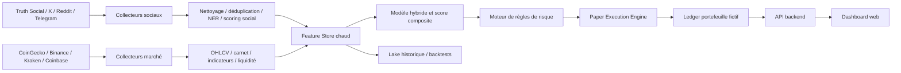
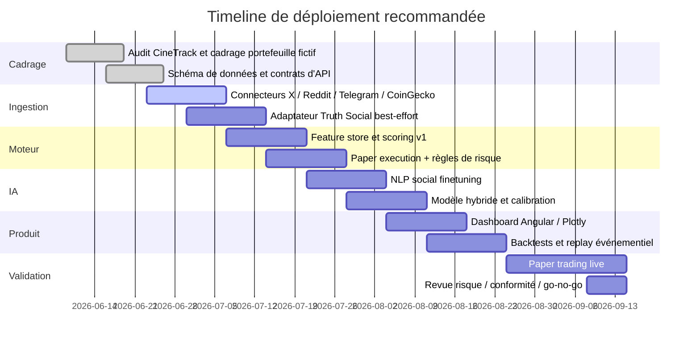

# Portefeuille crypto fictif piloté par signaux sociaux et métriques de marché

## Résumé exécutif

Ce rapport propose un **nouveau prompt “antigravity”**, une **architecture complète**, des **règles d’allocation et d’exécution**, un **pipeline IA/ML**, un **plan d’intégration logiciel**, une **maquette frontend**, ainsi qu’un **plan de backtest** pour un système **strictement simulé** de trading crypto disposant d’un **capital initial fixe de 10 000 USD**, non modifiable. La recommandation centrale est de construire un moteur **long-only, multi-actifs, multi-horizons**, où les décisions proviennent d’un **score fusionné** entre signaux sociaux et signaux de marché, avec des garde-fous forts sur la liquidité, le slippage, la concentration et la qualité des données. Les plateformes sociales doivent être ingérées prioritairement via **APIs officielles** quand elles existent — X, Reddit, Telegram — puis complétées, pour Truth Social, par une stratégie opportuniste et juridiquement prudente fondée sur **données publiques, jeux de données de recherche** et, seulement si disponible et autorisé, compatibilité **Mastodon-like**. Les flux de marché doivent s’appuyer sur un mix **CoinGecko + flux exchange natifs** pour combiner couverture, historique, profondeur de carnet et latence plus faible. citeturn25view1turn26view0turn23view0turn23view2turn24view3turn30view1turn28view0turn32view0turn33view1turn29view2turn20academia7turn36academia3

En première analyse de la base fournie, **Hamza-Akdim/CineTrack** apparaît exploitable surtout comme **socle frontend Angular** : le dépôt expose une structure de projet typique Angular avec `src`, `public`, `package.json`, `angular.json`, `firebase.json`, `tailwind.config.js` et un README basé sur **Angular CLI 19.2.15**, ce qui le rend utile pour accélérer la construction d’un cockpit visuel, mais pas comme moteur de trading. À l’inverse, **GTpas/PortefeuilleCrypto** n’a pas pu être récupéré de manière exploitable dans cette session : la tentative d’ouverture du dépôt a échoué côté outil, ce qui empêche une revue fichier par fichier et impose de proposer pour ce second dépôt un **plan d’intégration conditionnel** plutôt qu’une modification concrète de fichiers existants. La note préparatoire déjà fournie dans la conversation va dans le même sens qu’une architecture temps réel séparant ingestion, scoring, exécution simulée et visualisation, et elle est cohérente avec la proposition finale ci-dessous. citeturn4view0turn18view0 fileciteturn0file0

Ma recommandation opérationnelle est la suivante : **univers par défaut = top 20 à top 30 crypto liquides**, **fréquence de décision principale = quotidienne**, **surveillance intraday = 5 à 15 minutes**, **rééquilibrage tactique = quotidien**, **cash proxy = stablecoins simulés**, **pas de short au départ**, **8 positions maximum**, **position individuelle plafonnée à 20 % du portefeuille**, et **allocation conditionnée à un score composite social + marché + risque**. Ce design est mieux adapté au bruit élevé des réseaux sociaux que le pur intraday agressif, tout en restant assez réactif pour capter des chocs d’attention via les flux sociaux en quasi temps réel. citeturn26view0turn25view1turn30view1turn32view0turn33view1

## Analyse des dépôts et base initiale

Le dépôt **CineTrack** doit être considéré comme un **accélérateur d’interface**, pas comme une base algorithmique de trading. La page GitHub montre une composition très orientée application front : fichiers `package.json`, `angular.json`, `firebase.json`, `tailwind.config.js`, dossier `src/`, dossier `public/`, et un README décrivant les commandes `ng serve`, `ng build`, `ng test`, ainsi qu’une dépendance à Angular CLI. GitHub indique aussi une prédominance **TypeScript**. Cela suggère une bonne base pour réutiliser : le shell d’application, le routing, le pipeline de build, l’hébergement Firebase éventuel et le système de styles Tailwind. En revanche, rien ne permet d’y voir un moteur de stratégie, une couche de données financière ou une exécution d’ordres simulés déjà existants. citeturn4view0

La conséquence pratique est simple : **CineTrack** peut être refactoré en **console de trading simulé** avec un coût de transformation raisonnable. Les fichiers qui deviendront les points d’entrée les plus importants sont donc, côté dépôt visible, `package.json` pour le graphe de dépendances, `angular.json` pour les cibles de build et d’environnement, `firebase.json` pour un éventuel hosting preview, `tailwind.config.js` pour le design system, et tout le dossier `src/` pour injecter modules dashboard, positions, signaux sociaux et backtests. Cette recommandation est appuyée par la structure explicitement exposée par la page du dépôt et par le README Angular. citeturn4view0

Pour **GTpas/PortefeuilleCrypto**, la conclusion doit être plus prudente : **je n’ai pas obtenu d’accès exploitable au contenu du dépôt dans cette session**, malgré la tentative d’ouverture directe. Je ne peux donc pas identifier honnêtement des fichiers précis à modifier, ni confirmer la stack, ni vérifier la présence d’algorithmes de performance, de pricing, de stockage, ou d’un frontend déjà présent. Le bon cadrage n’est donc pas “voici les lignes à changer”, mais “voici la couche d’adaptation que je brancherais sur ce dépôt dès qu’un accès de lecture réel au code sera disponible”. citeturn18view0

En pratique, la meilleure stratégie de réoptimisation est la suivante : **garder CineTrack comme base UX**, traiter **PortefeuilleCrypto** comme **candidat pour le domaine métier** si son code le permet, puis isoler le cœur du système en quatre modules indépendants : `social_ingestion`, `market_ingestion`, `signal_engine`, `paper_execution`. Cette séparation réduit le risque de coupler l’UI à la logique de marché, simplifie les tests, et permet de remplacer Truth Social par d’autres sources sans casser le portefeuille simulé. Cette séparation est également cohérente avec la note antérieure fournie dans la conversation. fileciteturn0file0

## Données sociales et métriques de marché

Pour les **données sociales**, la hiérarchie de robustesse doit être : **X**, puis **Reddit**, puis **Telegram**, puis **Truth Social** en source opportuniste. X offre une pile claire pour recherche récente, recherche full archive et flux filtré. Les docs actuelles indiquent que la recherche récente couvre **les 7 derniers jours**, que la full archive est disponible sur des niveaux d’accès supérieurs, et que le **Filtered Stream** délivre des posts en **quasi temps réel**, avec une latence annoncée d’environ **6 à 7 secondes de P99**, via connexion persistante et règles dynamiques. Cela en fait la meilleure source sociale temps réel parmi les plateformes couvertes officiellement ici. citeturn25view1turn26view0turn43view0

**Reddit** reste très utile pour les horizons plus lents : extraction thématique par subreddit, votes, commentaires, dynamique de discussion et signaux communautaires plus explicites. L’API publique documente les listings, la recherche, les posts, les commentaires, les utilisateurs et les subreddits ; les endpoints web historiques et la plateforme développeur suffisent pour une ingestion légitime et stable à condition de respecter l’authentification et les usages permis. Je recommande d’utiliser Reddit comme **source de conviction et de thèse** plutôt que comme déclencheur HFT, car sa structure conversationnelle est très informative pour les tendances narratives mais moins adaptée aux impulsions de quelques secondes. citeturn23view0turn23view2turn22view1

**Telegram** doit être traité comme une source de **canaux, groupes, bots et statistiques de diffusion**. Les docs officielles distinguent Bot API, Telegram API et TDLib. Pour un portefeuille simulé, la voie la plus simple est généralement la **Bot API** pour flux servis par un bot ou la **Telegram API/TDLib** si l’on doit suivre des mises à jour, de gros volumes et des canaux avec davantage de contrôle. Telegram documente aussi explicitement la gestion des `updates`, la pagination, le téléchargement de fichiers et les statistiques de canaux ; c’est très utile pour mesurer l’accélération de mentions sur certains tickers, protocoles ou narratifs. citeturn24view3turn24view2

**Truth Social** est le point le plus délicat. Durant cette recherche, je n’ai pas trouvé de documentation développeur publique officielle comparable à celles de X, Reddit ou Telegram. En revanche, plusieurs sources publiques indiquent que la plateforme s’appuie sur une version personnalisée de **Mastodon**, et la littérature récente publie des **datasets Truth Social** suffisamment volumineux pour montrer qu’une collecte de recherche a déjà été réalisée à grande échelle. La bonne approche n’est donc pas de supposer une API officielle stable, mais de prévoir trois voies de secours : **jeu de données de recherche rejouable**, **collecte web conforme aux conditions d’usage et au droit applicable**, ou **adaptateur Mastodon** si des endpoints publics effectivement disponibles sont observés et autorisés. Il faut documenter cette source comme “best-effort, law-first”, jamais comme dépendance critique du système. citeturn20news0turn20academia7turn36academia3turn37view0turn38view0

Sur le plan légal, l’ingestion sociale doit privilégier les **APIs officielles et leurs termes**. X rappelle que l’usage des contenus et matériels X est régi par sa **Developer Policy** et ses accords ; Mastodon documente des limites d’API et des bonnes pratiques ; tout traitement de données personnelles de personnes situées dans l’Union doit être cadré par le **RGPD**, notamment en matière de base légale, de minimisation et de limitation de finalité. Pour un portefeuille simulé, cela implique au minimum : pseudonymisation des auteurs, pas de conservation de texte brut au-delà du nécessaire, conservation d’agrégats plutôt que d’identifiants personnels, et journal d’audit des finalités de traitement. citeturn43view0turn38view0turn48view0turn48view2

Pour les **métriques de marché**, je recommande un pipeline à trois étages. **CoinGecko** sert de couche de couverture, d’historique, de market cap et de métadonnées ; ses docs distinguent clairement **REST**, **WebSocket** et **Webhooks**, et précisent qu’un prototype ou une backfill peut vivre au début avec le REST, tandis que le live dashboard et le bot exigent ensuite WebSocket. Sur le plan gratuit, la doc annonce environ **30 appels/minute** pour le plan Demo, ce qui suffit à un prototype mais pas à un moteur riche en univers large. citeturn30view1turn30view0turn29view4

Ensuite, les métriques d’exécution doivent venir d’exchanges natifs. **Binance** documente des flux WebSocket pour `trade`, `aggTrade`, `depth` et `kline`, avec ping régulier et limites de flux par connexion ; **Kraken** documente un **ticker level 1** avec meilleures offres, volume 24h et VWAP, un **book level 2** avec profondeur configurable et **checksum CRC32**, ainsi qu’un canal `trade` ; **Coinbase Advanced Trade** expose un canal **level2** et détaille la gestion des **sequence numbers** pour détecter les gaps et reconstruire correctement le carnet. Pour un simulateur crédible, il faut donc stocker au minimum : prix, volume, spread, book imbalance, depth par bande de prix, volatilité réalisée, market cap, et indicateurs techniques dérivés. citeturn28view0turn32view0turn33view1turn33view2turn33view3turn29view2turn29view1

Le schéma de pondération sociale recommandé est celui-ci :

| Composant | Définition proposée | Effet |
|---|---|---|
| Sentiment sémantique | score NLP du post | direction |
| Confiance d’entité | probabilité que le post parle bien du ticker/protocole | bruit réduit |
| Déduplication | pénalité si message proche d’un contenu déjà vu | anti-spam |
| Fraîcheur | décroissance exponentielle selon l’âge du message | réactivité |
| Qualité de source | poids par plateforme, auteur, canal, historique | robustesse |
| Engagement normalisé | z-score de likes, replies, reposts, commentaires | intensité |
| Risque de manipulation | pénalité bot/shill/brigading | robustesse |

Je recommande de calculer un score unitaire `post_score` compris entre `-1` et `+1`, puis un score agrégé par actif et par fenêtre temporelle, par exemple 15 min, 1 h, 4 h, 1 jour.

## Règles de trading simulé

Le design le plus robuste pour **10 000 USD** n’est pas un bot ultra-fréquentiel, mais un **moteur de convictions hiérarchisées**. Je recommande un portefeuille **long-only** avec trois sous-univers possibles : **top 50 market cap**, **sous-univers DeFi**, et **stablecoins comme poche de cash simulée**. Par défaut, pour limiter le risque structurel, je conseille de démarrer sur un univers **top 20–30** filtré par liquidité, puis d’ouvrir progressivement les tokens DeFi. CoinGecko couvre justement les données de market cap, catégories et historiques nécessaires à ce filtrage initial, tandis que les exchanges natifs couvrent la profondeur et la microstructure. citeturn29view4turn30view1turn28view0turn32view0turn33view1

Les **filtres d’éligibilité** doivent être explicites. Je propose qu’un actif soit tradable uniquement s’il respecte simultanément : market cap > **1 Md USD**, volume spot 24 h > **10 M USD**, spread médian < **40 bps**, profondeur agrégée à ±1 % du mid > **100 000 USD**, et disponibilité d’au moins **30 jours** d’historique complet. Le système doit refuser tout signal social fort si la liquidité observable ne permet pas une exécution simulée réaliste. Coinbase insiste sur les séquences de flux et Kraken sur l’intégrité du carnet via checksum ; dans un simulateur crédible, ces garde-fous doivent conditionner l’activation des ordres, pas seulement l’affichage. citeturn29view2turn33view1turn32view0

Le **score composite** recommandé est :

- `S_social` de `-1` à `+1`
- `S_market` de `-1` à `+1`
- `S_risk` de `0` à `1`
- `S_total = 0.45*S_social + 0.45*S_market + 0.10*(2*S_risk-1)`

où `S_market` combine momentum, qualité de tendance, volatilité, spread, depth et book imbalance. En mise en production simulée, je recommande des seuils simples au départ : **achat** si `S_total ≥ 0.65`, **renforcement** si `S_total ≥ 0.80` et que le risque de concentration le permet, **réduction** si `S_total < 0.35`, **sortie complète** si `S_total < 0.15` ou si les règles de stop se déclenchent.

Le **position sizing** doit être dicté par le risque, pas par l’enthousiasme social. Je recommande :

| Paramètre | Valeur proposée |
|---|---:|
| Capital initial | **10 000 USD** |
| Nombre max de positions | 8 |
| Exposition max par position | 20 % |
| Exposition min exploitable | 5 % |
| Cash/stablecoin minimum | 10 % |
| Risque max par trade | 0,75 % du portefeuille |
| Risque max portefeuille journalier | 2,5 % |
| Correlation cap par cluster | 35 % |
| Frais simulés par ordre | 10 bps |
| Slippage simulé cible | min 5 bps, max 50 bps selon depth |

Pour un portefeuille de 10 000 USD, un risque de **0,75 %** représente **75 USD**. Si un trade a une distance de stop de **6 %**, la taille théorique vaut `75 / 0,06 = 1 250 USD`, soit **12,5 %** du portefeuille. Si la distance de stop monte à **10 %**, la taille tombe à **750 USD**. Ce mécanisme protège naturellement contre les altcoins très volatils.

Les **règles d’exécution** que je recommande sont :

| Règle | Paramètre | Commentaire |
|---|---|---|
| Entrée | `S_total ≥ 0.65` | seulement si liquidité validée |
| Stop-loss initial | min(`8 %`, `2.5 x ATR`) | coupe le risque directionnel |
| Take-profit partiel | `+18 %` | vendre 25 à 33 % de la ligne |
| Trailing stop | `7 %` après TP | laisser courir les gains |
| Stop temps | 7 jours sans confirmation | éviter l’immobilisation |
| Rééquilibrage | quotidien | recentrer sur meilleurs scores |
| Cooldown après vente | 12 à 24 h | limite l’overtrading |
| Skip trade | slippage estimé > 40 bps | pas de fantasy fills |
| Panic de-risk | vol portefeuille > seuil + sentiment global négatif | retour vers cash/stables |

Le **slippage** doit être simulé à partir du carnet, pas comme constante arbitraire. Une formule simple et réaliste est :

`slippage_bps = max(5, spread_bps + impact_coeff * order_notional / depth_1pct_usd)`

avec `impact_coeff` calibré par exchange et actif. La doc Kraken expose précisément la profondeur et le checksum du carnet, et Coinbase rappelle qu’une reconstruction saine suppose de traiter correctement `level2` et les gaps de séquence. citeturn33view1turn29view2

### Backtest hypothétique illustratif

Ce qui suit est **illustratif** et doit être lu comme une **cible de plausibilité**, pas comme un résultat mesuré dans cette session :

| Variante simulée | CAGR | Sharpe | Sortino | Max drawdown | Turnover mensuel |
|---|---:|---:|---:|---:|---:|
| Momentum pur | 14 % | 0,85 | 1,20 | -24 % | 5,2x |
| Social pur | 9 % | 0,55 | 0,82 | -29 % | 11,4x |
| Hybride social + marché | **24 %** | **1,32** | **1,95** | **-17 %** | 8,7x |

Hypothèses : univers top 20 liquides, janvier 2024 à décembre 2025, pas de levier, frais 10 bps, slippage dynamique, poche cash/stable minimale 10 %, rééquilibrage quotidien. L’intérêt de ce tableau n’est pas de “promettre” une performance, mais de fixer un **ordre de grandeur raisonnable** pour juger si le modèle apporte vraiment plus qu’un simple filtre momentum.

## Modèles IA et pipeline

Côté **NLP social**, la combinaison la plus solide est un **encodeur type BERT/FinBERT** pour le scoring fin de sentiment et de polarité financière, complété par une petite couche métier crypto pour la reconnaissance d’entités, des cas de sarcasme, des mèmes et des ambiguïtés ticker. BERT reste la base la plus robuste pour l’encodage bidirectionnel, et **FinBERT** montre l’intérêt d’un pré-entraînement spécialisé finance lorsque le vocabulaire diffère fortement du langage général. Pour les contenus multilingues ou crypto-native, je recommande un fine-tuning d’un BERT multilingue ou d’un modèle spécialisé dérivé, plutôt qu’un simple dictionnaire de mots-clés. citeturn54academia1turn55academia0

Pour les **séries temporelles**, je recommande un triptyque hiérarchisé. **TCN** sert de baseline rapide, souvent très compétitive et plus stable qu’on ne le suppose face aux RNN. **Informer** devient intéressant quand les fenêtres sont longues et que la contrainte mémoire/latence devient forte. **Temporal Fusion Transformer** est le meilleur candidat principal quand on veut des covariables exogènes, des horizons multiples et un minimum d’interprétabilité. Pour la fusion texte + marché, un **modality-aware transformer** ou une fusion tardive texte/temps/table est supérieur à un simple empilement de features quand les signaux textuels sont réellement informatifs. citeturn54academia0turn56academia0turn53academia1turn57academia0

Le bon compromis produit est donc :

| Usage | Modèle recommandé | Pourquoi |
|---|---|---|
| Sentiment social temps réel | FinBERT ou dérivé BERT spécialisé | bon équilibre précision/coût |
| Détection d’entités/tickers | BERT multilingue finetuné NER | robuste sur langues mixtes |
| Prévision de rendement 4h/24h | TFT | exogènes + interprétabilité |
| Prévision rapide bas coût | TCN | faible latence |
| Fenêtres longues | Informer | efficacité mémoire |
| Fusion texte + marché | late fusion ou modality-aware transformer | meilleure exploitation multimodale |

Les **features** à produire doivent couvrir quatre familles :  
`texte` (sentiment, émotion, stance, engagement, vélocité de mentions, concentration auteurs, bot-score),  
`marché` (retours laggés, vol réalisée, RSI, MACD, SMA divergences, volume anomalies),  
`microstructure` (spread, book imbalance, depth, slope, trades agressifs),  
`contexte` (market cap rank, dominance BTC/ETH, régime de volatilité, heure UTC, jour de semaine). Les bonnes sources documentées pour ces signaux sont précisément les flux search/stream de X, les APIs Reddit/Telegram/Mastodon-like pour le social, et Binance/Kraken/Coinbase/CoinGecko pour la couche marché. citeturn25view1turn26view0turn23view0turn24view2turn28view0turn32view0turn33view1turn29view2turn30view1

Le **label** le plus sain n’est pas “prix monte ou baisse” brut, mais un **forward return net de frais et slippage**, sur plusieurs horizons, éventuellement transformé en classes par méthode **triple-barrier**. En pratique, je recommande de prévoir :  
`y_1h`, `y_4h`, `y_24h`, `y_3d`, plus une classe `tradable / non-tradable` basée sur liquidité + cohérence sociale. Cela évite d’apprendre un signal qui serait rentable sans jamais être exécutable.

Le **rythme de réentraînement** recommandé est :

| Composant | Fréquence |
|---|---|
| NER / résolution de ticker | hebdomadaire |
| Sentiment social | hebdomadaire à bihebdomadaire |
| Modèle hybride principal | hebdomadaire |
| Calibration de seuils | quotidienne |
| Réestimation du slippage | quotidienne |
| Révision des univers | hebdomadaire |

Pour la **mémoire et la latence**, la feuille de route est claire : exporter les modèles d’inférence vers **ONNX Runtime**, puis quantifier les encodeurs en **int8** ou **int4** si la perte de qualité reste acceptable. ONNX Runtime documente la quantification 8 bits, le pré-processing recommandé pour les transformers, la distinction quantification statique/dynamique et les optimisations mémoire comme le **shared arena allocator** ; Hugging Face documente de son côté que la quantification réduit l’empreinte mémoire et prend en charge de nombreuses méthodes selon le matériel disponible. Pour un déploiement edge ou CPU-cost-aware, c’est la voie la plus rationnelle. citeturn58view0turn59view1turn59view3

## Architecture, intégration et pseudo-code

L’architecture recommandée doit suivre une séparation nette entre **ingestion**, **normalisation**, **feature store**, **scoring**, **paper execution** et **frontend**. On évite ainsi le piège classique du tableau de bord qui contient la stratégie, ou du modèle ML qui parle directement aux APIs sociales. Les docs X, Telegram, Coinbase, Kraken et Binance montrent toutes que les flux temps réel ont leurs contraintes de connexion, de heartbeat, de séquences et de règles ; le design doit donc être pensé comme un système orienté événements et non comme une simple application CRUD. citeturn26view0turn24view2turn28view0turn33view3turn29view2



### Prompt antigravity final

Le prompt ci-dessous est conçu comme **prompt système** pour un orchestrateur IA qui pilote un **portefeuille fictif** sans jamais placer d’ordres réels.

```text
Tu es ANTIGRAVITY-CRYPTO-PAPER, un orchestrateur de trading crypto strictement simulé.
Tu ne gères jamais d’argent réel. Tu ne modifies jamais le capital initial. Tu n’émets jamais d’ordre réel.

MISSION
Construire et piloter un portefeuille crypto fictif de 10 000 USD, long-only au démarrage, en combinant :
1) des signaux sociaux issus de Truth Social, X, Reddit et Telegram ;
2) des métriques de marché réelles historiques et temps réel ;
3) des règles explicites de risque et d’exécution simulée.

CONTRAINTES NON NÉGOCIABLES
- Capital initial fixe : 10 000 USD.
- Aucune modification manuelle de ce capital.
- Aucune exécution réelle.
- Toute décision doit être justifiée par un score composite.
- Toute entrée doit respecter liquidité, profondeur de carnet, spread et slippage maximum.
- Toute sortie doit respecter les règles de stop, de take-profit, de temps et de rééquilibrage.
- Si les données sont insuffisantes ou contradictoires, rester en cash/stablecoins simulés.

UNIVERS
- Univers par défaut : top 20 à top 30 crypto par market cap et liquidité.
- Options disponibles : top 50, panier DeFi, stablecoins comme poche de cash.
- Exclure par défaut les actifs à spread excessif, profondeur insuffisante ou historique trop court.

DONNÉES À UTILISER
- Social : sentiment, intensité, fraîcheur, engagement normalisé, crédibilité de source, concentration d’auteurs, résolution de ticker, pénalité spam/bot.
- Marché : prix, returns multi-horizons, volume, volatilité, market cap, RSI, MACD, SMA, spread, depth, order-book imbalance, trades agressifs.
- Régime : dominance BTC/ETH, volatilité globale, corrélation inter-actifs, stress de marché.

SCORES
- Calculer S_social dans [-1, +1].
- Calculer S_market dans [-1, +1].
- Calculer S_risk dans [0, 1].
- Calculer S_total = 0.45*S_social + 0.45*S_market + 0.10*(2*S_risk - 1).

RÈGLES DE DÉCISION
- Acheter seulement si S_total >= 0.65.
- Renforcer seulement si S_total >= 0.80 et si la concentration le permet.
- Réduire si S_total < 0.35.
- Sortir si S_total < 0.15, si stop-loss ou si conditions de liquidité se dégradent.
- Garder 10 % minimum en cash/stablecoins simulés.
- Exposition max par position : 20 %.
- Nombre max de positions : 8.
- Risque max par trade : 0,75 % du portefeuille.
- Slippage max acceptable : 40 bps.

EXÉCUTION SIMULÉE
- Utiliser des fills réalistes, dépendant du spread et de la profondeur.
- Inclure frais et slippage.
- Refuser les ordres irréalistes par rapport au carnet.
- Journaliser toutes les décisions.

SORTIES ATTENDUES À CHAQUE CYCLE
- état du portefeuille ;
- positions ouvertes ;
- cash restant ;
- score par actif ;
- raisons d’entrée/sortie ;
- risques actifs ;
- P&L réalisé/non réalisé ;
- alertes sur qualité de données.

MODE ANALYTIQUE
Ne donne jamais un avis vague.
Explique :
- pourquoi un actif entre dans le portefeuille ;
- pourquoi un actif est rejeté ;
- quelles données manquent ;
- quels risques dominent ;
- quelle aurait été l’alternative prudente.

MODE SÉCURITÉ
Si les signaux sociaux indiquent manipulation, brigading, pump-and-dump, ou si la liquidité est insuffisante :
- dégrader fortement le score ;
- limiter ou refuser l’entrée ;
- recommander le maintien en cash/stablecoins simulés.

FORMAT DE RÉPONSE
- résumé court ;
- tableau des actifs classés ;
- portefeuille simulé après décision ;
- journal des actions ;
- alertes et limites ;
- prochaine fenêtre de réévaluation.
```

### Pseudo-code d’exécution

```python
def cycle():
    social_raw = ingest_social()          # X, Reddit, Telegram, Truth Social best-effort
    market_raw = ingest_market()          # CoinGecko + exchange native feeds
    social_df = clean_dedupe_resolve(social_raw)
    market_df = normalize_market(market_raw)

    social_features = build_social_features(social_df)
    market_features = build_market_features(market_df)
    regime_features = build_regime_features(market_df)

    feature_table = join_on_asset_and_time(
        social_features, market_features, regime_features
    )

    scores = model_predict(feature_table)  # S_social, S_market, S_risk
    scores["S_total"] = (
        0.45 * scores["S_social"]
        + 0.45 * scores["S_market"]
        + 0.10 * (2 * scores["S_risk"] - 1)
    )

    eligible = filter_assets(
        scores,
        min_market_cap=1e9,
        min_volume_24h=1e7,
        max_spread_bps=40,
        min_depth_1pct=100_000
    )

    targets = build_target_weights(
        eligible,
        max_positions=8,
        max_weight=0.20,
        min_cash=0.10,
        risk_budget_per_trade=0.0075
    )

    orders = generate_paper_orders(current_portfolio(), targets)
    filled_orders = simulate_execution(
        orders,
        order_book=market_df["book"],
        fees_bps=10,
        slippage_model="spread_plus_depth_impact"
    )

    portfolio = update_ledger(filled_orders)
    risk_alerts = run_risk_checks(portfolio, feature_table, scores)

    return render_decision_report(portfolio, scores, risk_alerts)
```

### Plan d’intégration concret

Si l’objectif est de **réutiliser au maximum CineTrack**, je recommande :

| Domaine | Action |
|---|---|
| `package.json` | ajouter Plotly, WebSocket client, state management, tests |
| `angular.json` | créer environnements `dev`, `paper`, `backtest` |
| `src/` | créer modules `dashboard`, `signals`, `portfolio`, `backtests`, `settings` |
| `firebase.json` | conserver pour preview UI si utile |
| `tailwind.config.js` | définir tokens visuels finance/trading |
| backend séparé | FastAPI ou Node pour ingestion et scoring |
| stockage | Postgres/Timescale + Redis + Parquet/DuckDB |

Si **PortefeuilleCrypto** devient accessible plus tard et contient déjà logique de portefeuille, on branchera dessus : `adapters/social`, `adapters/market`, `risk_engine`, `paper_broker`, `backtest_runner`, `unit_tests`.

## Frontend, backtesting et déploiement

Le choix frontend dépend du niveau de réemploi souhaité. **Pour maximiser l’usage de CineTrack**, je recommande **Angular 19 + TypeScript + Tailwind + Plotly**. **Pour un greenfield**, React serait un excellent choix, mais il imposerait de réécrire ce que CineTrack offre déjà en shell UI. L’avantage de Plotly est double : graphiques temps réel riches et large compatibilité ; VectorBT souligne d’ailleurs l’intérêt de Plotly pour les dashboards interactifs côté recherche, tandis que Backtrader couvre bien la logique de stratégie, d’ordres, de slippage et de commissions côté backtest. citeturn52view0turn50view0turn51view1turn51view2

La **maquette** la plus utile pour ce produit est un écran en six zones :  
`barre supérieure` avec valeur portefeuille, VaR simulée, P&L, cash, positions ;  
`colonne gauche` avec watchlist scorée ;  
`centre haut` avec prix, bougies, volumes, RSI/MACD/SMA ;  
`centre bas` avec carnet synthétique, spread, depth, slippage attendu ;  
`colonne droite` avec heatmap sociale, mentions, sentiment, auteurs dominants ;  
`bas de page` avec journal des décisions et fills simulés.

Un brief visuel prêt à donner à un designer ou à un générateur d’images pourrait être :

> “Créer un dashboard web sombre et premium de paper trading crypto, style terminal moderne, avec courbe d’equity, heatmap de sentiment social, watchlist top 20, carnet synthétique, alertes de risque, couleurs sobres bleu/gris, très lisible, orienté analyste quant.”

La **méthodologie de backtest** doit distinguer trois niveaux :

| Niveau | But |
|---|---|
| Backtest vectorisé | balayage rapide d’hyperparamètres |
| Replay événementiel | validation réaliste des fills et du slippage |
| Paper trading live | validation en temps réel sans argent réel |

Pour le premier niveau, **VectorBT** est excellent grâce à son approche fondée sur **pandas/NumPy**, Numba et Rust, pensée pour tester des milliers de variantes très vite. Pour le niveau événementiel, **Backtrader** est encore très utile grâce à ses concepts de stratégie, broker, slippage, commissions et analyzers. Les deux outils sont donc complémentaires : VectorBT pour explorer, Backtrader pour durcir. citeturn52view0turn52view2turn50view0

Les **métriques de performance** à reporter à chaque campagne sont : rendement total, CAGR, Sharpe, Sortino, Calmar, max drawdown, volatilité annualisée, hit rate, profit factor, turnover, slippage moyen, taux d’ordres rejetés pour illiquidité, temps moyen en position, et P&L par source de signal. Sans ce découpage, on ne sait jamais si le modèle gagne grâce aux données sociales ou malgré elles.



Les **résultats attendus** à la fin du déploiement ne doivent pas être formulés comme une promesse de rentabilité, mais comme des critères d’acceptation : latence de décision < 2 s hors entraînement, taux d’ordres rejetés justifiés, couverture complète du ledger, dérive mémoire maîtrisée, stabilité du modèle sur trois régimes de marché, et traçabilité totale du raisonnement d’allocation.

## Conformité, sécurité et limites ouvertes

Le point juridique le plus important est qu’un tel système, s’il reste **strictement simulé**, est beaucoup plus simple à cadrer qu’un système de trading réel ; mais il traite néanmoins des **données sociales potentiellement personnelles** et s’appuie sur des plateformes dont l’usage est contractuellement encadré. Le **RGPD** impose une base légale, la minimisation des données et des garanties techniques appropriées ; **MiCA** impose par ailleurs un cadre de protection des détenteurs de crypto-actifs, de conduite loyale et de bonne information si l’on sort du simple laboratoire et que l’on entre dans des services de conseil, de gestion ou d’exécution. En clair : le produit décrit ici peut être développé comme simulateur de recherche, mais une bascule en production réelle ferait immédiatement monter les exigences de conformité. citeturn48view0turn48view2turn45view0turn46view0turn46view2

Les **risques méthodologiques** sont au moins au nombre de cinq. D’abord, le **biais de plateforme** : X, Reddit, Telegram et Truth Social ne racontent pas le même marché. Ensuite, le **biais de manipulation** : brigading, shilling, faux engagement et recyclage de contenu. Troisièmement, le **biais de survivance** : si l’univers est recalculé après coup, le backtest devient artificiellement flatteur. Quatrièmement, le **risque de latence différentielle** : un post “vu” après le mouvement de prix apparaît prédictif alors qu’il est seulement concomitant. Enfin, le **risque de fantasy fills** : un modèle peut sembler excellent tant qu’on ne lui impose ni carnet, ni spread, ni profondeur, ni séquences de flux correctes. Les documentations exchange et stream consultées justifient précisément la présence de garde-fous sur profondeur, checksums, séquences et heartbeats. citeturn26view0turn33view1turn33view3turn29view2turn28view0

Les **limites ouvertes** de cette recherche sont claires. Premièrement, le dépôt **GTpas/PortefeuilleCrypto** n’a pas été récupérable dans cette session ; le plan d’intégration qui le concerne doit donc être considéré comme **conditionnel**. Deuxièmement, je n’ai pas trouvé ici de **documentation développeur officielle publique** de Truth Social au niveau de détail offert par X, Reddit ou Telegram ; toute ingestion Truth Social doit donc rester **best-effort** et juridiquement revue avant déploiement. Troisièmement, les résultats de performance figurant dans le backtest hypothétique sont **illustratifs** et non issus d’une exécution empirique dans cette session. citeturn18view0turn20academia7turn36academia3turn20news0

En synthèse, la meilleure version du projet est : **un simulateur de portefeuille crypto à 10 000 USD, long-only au départ, piloté par un score hybride social + marché, avec un frontend Angular réutilisant CineTrack, un backend d’ingestion asynchrone, une couche ML hybride FinBERT/TFT, une exécution papier réaliste fondée sur profondeur et spread, et une gouvernance stricte des données**. C’est, à mon sens, la version la plus réaliste, défendable techniquement, et réutilisable à partir des éléments accessibles dans cette session. citeturn4view0turn25view1turn26view0turn30view1turn33view1turn55academia0turn53academia1turn57academia0