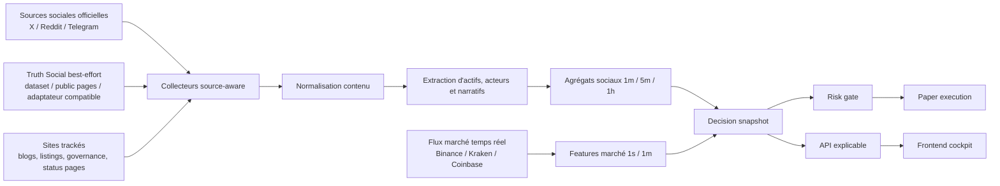

# Refonte approfondie de Signals & Sentiments pour PortefeuilleCrypto

La bonne lecture des changements récents est que le projet n’est plus un simple terminal de prix. Vos documents internes cadrent déjà un portefeuille papier de 10 000 USD, une logique de score composite social + marché + risque, une architecture d’ingestion fondée sur WebSockets natifs + CCXT + TimescaleDB, et un cockpit frontend en cinq zones avec watchlist, panneau social et journal d’activité. La suite la plus pertinente n’est donc pas une refonte totale, mais l’industrialisation de la brique **Signals & Sentiments** en sous-système traçable, explicable, robuste en Docker et lisible côté utilisateur. fileciteturn0file0 fileciteturn0file1 fileciteturn0file2

## Direction du projet après les changements récents

Vos trois documents forment déjà une base stratégique cohérente. Le plan d’implémentation prévoit un durcissement du `docker-compose.yml`, l’ajout de Redis, un cockpit frontend en cinq zones, des endpoints `watchlist`, `signals`, `trades/recent` et `portfolio/pnl`, puis des migrations TimescaleDB pour les continuous aggregates et les politiques de compression. Le rapport portefeuille fixe déjà le cadre métier du mode papier : capital fixe à 10 000 USD, long-only au démarrage, huit positions maximum, exposition max à 20 % par position et décisions fondées sur `S_total`. Le rapport ingestion fixe quant à lui le cadre technique : flux live via Binance, Kraken et Coinbase en WebSocket natif, CCXT pour bootstrap et backfill, CoinGecko hors hot path, TimescaleDB par défaut. Cela veut dire que la nouvelle section **Signals & Sentiments** doit **étendre l’existant**, pas le réécrire à plat. fileciteturn0file0 fileciteturn0file1 fileciteturn0file2

L’évolution visuelle fournie confirme cette direction. On passe d’une vue initiale très centrée sur un chart unique et quelques métriques minimales à un vrai cockpit qui expose déjà une watchlist, des badges de score et un espace de décision. Le chantier principal n’est donc plus seulement esthétique : il est désormais **sémantique**, **explicatif** et **opérationnel**.


Le point clé à retenir est le suivant : votre projet possède déjà la bonne colonne vertébrale produit. La section **Signals & Sentiments** doit maintenant devenir une **chaîne complète de preuves** allant de la collecte d’un post ou d’un article jusqu’à l’explication finale d’un achat, d’une réduction, d’une absence d’achat ou d’un passage en cash simulé. C’est précisément ce qui manque à la plupart des dashboards crypto “sociaux” : ils affichent des scores, mais ne conservent pas la causalité détaillée qui a produit la décision. Votre base documentaire invite justement à combler cette lacune. fileciteturn0file0 fileciteturn0file1

## Architecture cible pour Signals & Sentiments

Pour la collecte sociale, il faut privilégier les **APIs officielles** lorsque c’est possible, puis isoler les sources plus fragiles derrière des adaptateurs et des feature flags. X fournit deux briques majeures : la recherche récente sur sept jours, la recherche full archive à un niveau d’accès supérieur, et surtout le **Filtered Stream**, qui permet de recevoir des posts en quasi temps réel via une connexion persistante, avec une latence annoncée d’environ **6 à 7 secondes de P99**. X documente aussi explicitement les keep-alives, le backfill pour les déconnexions courtes et la recovery sur une fenêtre allant jusqu’à 24 heures pour certains niveaux d’accès. C’est la meilleure source pour la composante “attention shock” et la vélocité de mentions. citeturn10view0turn23view0turn22view0

Reddit joue un autre rôle. Les docs développeur et l’API publique exposent les posts, commentaires, listings et objets de subreddit ; c’est donc une bonne source pour la **conviction narrative**, la qualité argumentative et la persistance d’une thèse plutôt que pour l’impulsion ultra-courte. Autrement dit, Reddit doit servir à mesurer si une narration crypto tient dans le temps, se structure en discussion, ou reste un feu de paille. citeturn11view0turn10view3

Telegram est très utile pour la couche “canaux et diffusion”. La Bot API est une interface HTTP officielle, avec `getUpdates` ou webhooks, des messages JSON standardisés, et une rétention des updates jusqu’à 24 heures côté serveur. Quand le besoin devient plus avancé — gros volume, ordre des updates, meilleur contrôle client — TDLib apporte justement une bibliothèque multi-plateforme qui gère réseau, chiffrement, stockage local et livraison ordonnée des mises à jour. En pratique, cela justifie une architecture à deux modes : **Bot API** pour l’intégration simple et **TDLib** pour les canaux ou flux à suivre plus finement. citeturn12view0turn13view0turn13view1

Pour Truth Social, les sources publiques les plus exploitables dans cette recherche sont des **datasets de recherche** plutôt qu’une documentation développeur stable. Le papier *Truth Social Dataset* décrit un corpus de plus de **823 000 posts** et plus de **454 000 utilisateurs distincts**. Le papier *TruthStance* décrit pour sa part **24 378 posts** et **523 360 commentaires** avec structure conversationnelle conservée, ainsi qu’un benchmark annoté. J’en déduis qu’il faut traiter Truth Social comme une source **best-effort** avec trois modes : import de datasets pour le backfill de recherche, collecteur public pour pages/accessibles publiquement si cela est permis, et adaptateur “Mastodon-like” uniquement si des endpoints publics réellement utilisables sont observés. Votre note existante adopte déjà la même logique prudente. citeturn0academia5turn0academia3 fileciteturn0file1

Cette décision est renforcée par la documentation Mastodon elle-même. Mastodon expose une API complète avec méthodes `search`, `statuses`, `timelines`, `streaming`, `trends`, ainsi que des limites documentées par défaut de **300 appels par 5 minutes** par compte et par IP. Cela en fait une bonne matrice de conception pour un adaptateur compatible, mais pas un argument pour placer Truth Social dans le hot path. L’architecture la plus saine consiste donc à garder Truth Social hors dépendance critique, avec persistance des preuves, files bornées, et dégradation gracieuse si la source se tarit. citeturn28view0turn29view0



Concrètement, la brique **Signals & Sentiments** doit suivre quatre familles de sources. D’abord les **acteurs** : fondateurs/protocoles, équipes d’exchanges, market makers, chercheurs sécurité, émetteurs d’ETF et comptes officiels produit. Ensuite les **sites** : blogs officiels, pages de listing, status pages, forums de gouvernance, docs de protocole, annonces réglementaires. Puis les **contenus sociaux** : posts, reposts, commentaires, réponses, réactions, métriques d’engagement. Enfin les **objets d’explication** : quelles sources ont parlé de quel actif, à quel moment, avec quelle crédibilité et quelle confirmation marché. Cette séparation est ce qui permettra d’afficher plus tard non seulement un score, mais **l’arbre causal du score**. fileciteturn0file0 fileciteturn0file1

## Métriques et moteur décisionnel

Je recommande de **conserver la logique métier déjà définie** dans votre base, plutôt que de la casser. Votre document existant fixe un `S_total` combinant dimension sociale, dimension marché et dimension risque, avec des seuils clairs d’achat, renforcement, réduction et sortie. Cette convention est bonne, car elle sépare le signal directionnel du contrôle du risque. Je conserverais donc le cœur suivant, tout en enrichissant fortement les sous-scores et la trace d’explication : `S_total = 0.45*S_social + 0.45*S_market + 0.10*(2*S_risk - 1)`, achat à partir de `0.65`, renforcement à `0.80`, réduction sous `0.35`, sortie sous `0.15`, avec cash/stables simulés comme refuge si les données se dégradent. fileciteturn0file1

La meilleure manière de rendre cette logique beaucoup plus robuste est de décomposer les sous-scores en **métriques atomiques** que l’interface peut afficher et que le backend peut historiser.

| Famille | Métriques recommandées | Fenêtre principale | Rôle décisionnel |
|---|---|---:|---|
| Social intensité | `mention_velocity_z`, `unique_authors`, `engagement_velocity`, `reply_ratio`, `repost_ratio` | 1m, 5m, 1h | Détecter le choc d’attention |
| Social qualité | `actor_influence_score`, `historical_lift`, `source_credibility`, `entity_confidence`, `bot_risk_penalty` | 1h, 24h, 90j | Éviter le bruit et les faux signaux |
| Social sémantique | `sentiment_polarity`, `stance_score`, `certainty_score`, `novelty_score`, `narrative_cluster` | 5m, 1h | Mesurer le sens du récit |
| Marché tendance | `ret_15m`, `ret_1h`, `ret_4h`, `trend_alignment`, `relative_volume` | 1m, 5m, 1h | Confirmer ou invalider le récit |
| Microstructure | `spread_bps`, `depth_usd_10bps`, `book_imbalance`, `trade_pressure`, `slippage_bps_est` | 1s, 10s, 1m | Filtrer l’exécutabilité réelle |
| Risque portefeuille | `position_concentration`, `portfolio_vol`, `btc_corr`, `drawdown_state`, `liquidity_stress` | 1m, 1h, 1j | Décider de la taille ou du refus |

L’intérêt de cette décomposition est qu’elle colle à la littérature et aux contraintes de marché réelles. La recherche sur la crypto et les réseaux sociaux montre depuis plusieurs années qu’un sentiment agrégé, surtout lorsqu’il est **pondéré par la diffusion** plutôt que simplement compté, peut apporter un signal prédictif. Des travaux plus récents sur *Crypto Twitter* montrent aussi que les conversations sociales peuvent refléter des incidents réels et que les réseaux de bots y sont non négligeables ; la littérature spécialisée sur la détection de bots, elle, converge vers des approches qui combinent **texte**, **métadonnées** et **graphe social**. Cela justifie pleinement d’intégrer dans `S_social` non seulement la polarité du texte, mais aussi une **pénalité bot**, une **crédibilité de source** et une **confirmation multi-source**. citeturn26academia1turn26academia2turn27academia0turn27academia1turn27academia2turn27academia3

Pour la partie marché, il faut rester proche de ce qu’un desk crypto considérerait comme réellement utile. Kraken documente explicitement dans son canal `ticker` le **best bid**, le **best ask**, leurs quantités et le dernier trade ; son flux `book` expose une profondeur paramétrable et un **checksum CRC32** sur le top of book. Coinbase documente que son canal `level2` garantit la livraison des updates et constitue la manière la plus simple de garder un snapshot cohérent du carnet ; le canal `ticker` embarque déjà `best_bid`, `best_ask`, quantités et variations. Binance, de son côté, fournit des `aggTrade` en temps réel et des klines `1s`. Enfin, la littérature microstructure montre qu’un **queue imbalance** du carnet a bien un pouvoir prédictif sur la direction du prochain mouvement de mid-price. Tout cela justifie que `S_market` incorpore **spread**, **depth**, **book imbalance**, **trade pressure** et **coût d’exécution estimé**, pas seulement du momentum OHLCV. citeturn19view1turn19view2turn19view3turn18view0turn20view0turn21view0turn26academia3

Je recommande donc la logique suivante pour les sous-scores. `S_social` doit être un score continu dans `[-1, +1]` issu d’une combinaison du **sens du message**, de la **qualité de la source**, de la **largeur de diffusion**, de la **fraîcheur**, de la **novelty** et de la **pénalité bot/spam**. `S_market` doit également vivre dans `[-1, +1]` mais ne jamais être calculé sans métriques de liquidité. `S_risk` doit vivre dans `[0, 1]` et servir de **gating layer** : si le slippage estimé est trop haut, si la concentration portefeuille devient excessive, ou si le régime de volatilité est hostile, le portefeuille ne doit pas acheter, même en présence d’un récit social puissant. Cette hiérarchie est la seule manière d’éviter les achats “fantasy fills” sur des actifs dont le discours est fort mais la profondeur trop faible. fileciteturn0file1

Le point décisif pour la nouvelle section est toutefois ailleurs : il faut **historiser les contributions au score**. À chaque décision, le moteur doit écrire un `decision_snapshot` contenant les sous-scores, puis des lignes `decision_factor` détaillant les contributions : par exemple “+0.18 car mention velocity z-score sur ETH > 3”, “+0.09 car trois sources officielles convergent”, “-0.11 car spread > 9 bps”, “-0.08 car bot risk élevé”, “-0.14 car corrélation portefeuille/BTC trop forte”. Sans cette granularité, la section **Signals & Sentiments** restera jolie à l’écran, mais faible comme outil de confiance.

## Backend, stockage Docker et traçabilité

Votre plan interne va déjà dans la bonne direction côté exécution locale : durcissement du `docker-compose.yml`, healthchecks, ajout de Redis, endpoints dédiés et migrations TimescaleDB de continuous aggregates puis de compression. Je recommande de prendre ce plan comme base immédiate. fileciteturn0file0


La recommandation de fond reste **TimescaleDB comme stockage par défaut**, avec Redis comme couche chaude et éventuellement MinIO ou un bucket S3-compatible pour les payloads bruts lourds. La doc Tiger Data explique que les continuous aggregates se rafraîchissent automatiquement en arrière-plan à mesure que les données arrivent ou changent ; les real-time aggregates permettent de combiner les données matérialisées et les données brutes récentes ; la compression/columnstore est toujours supportée et peut réduire les chunks de plus de 90 %. Pour un système qui veut à la fois historiser du signal, requêter vite et rester PostgreSQL-natif, c’est encore le meilleur compromis. citeturn16view0turn17view3

Je déconseille en revanche de mettre Redis au cœur de la vérité métier. Redis doit servir de **cache chaud**, de store de fenêtres courtes, de bus de publication temps réel pour l’UI et d’anti-doublon court terme, mais la vérité durable doit rester dans Timescale/PostgreSQL. La raison est simple : vous voulez pouvoir reconstituer une décision, rejouer un backtest, recalculer un score après changement de modèle et expliquer une position au portefeuille test. Ce sont des besoins d’**auditabilité**, pas seulement de faible latence. Cette orientation est cohérente avec le fait que votre base documentaire insiste déjà sur l’idempotence, les payloads bruts et le writer dédupliqué. fileciteturn0file2

Sur le plan du schéma, je recommande une séparation très nette entre tables de **dimension**, tables de **contenu brut**, tables de **features**, tables de **décision**, et tables de **simulation portefeuille**.

| Table | Type | Support | Rétention suggérée | Finalité |
|---|---|---|---|---|
| `tracked_actor` | dimension | Postgres | longue | registre des comptes, sites, rôles, qualité |
| `tracked_asset_site` | dimension | Postgres | longue | mapping actifs ↔ sources officielles |
| `raw_content` | temps réel | Timescale + objet brut | 30 à 90 j en DB, plus long en objet storage | payload source, hash, URL canonique |
| `content_entity` | relation | Postgres | longue | actifs, tickers, narratifs extraits |
| `social_signal_1m` | hypertable | Timescale | 180 j | agrégats sociaux par actif/source |
| `market_feature_1s` | hypertable | Timescale | 30 à 90 j | spread, depth, imbalance, trades |
| `market_feature_1m` | cagg | Timescale | 365 j | synthèse marché pour score |
| `decision_snapshot` | hypertable | Timescale | longue | scores finaux, action proposée |
| `decision_factor` | hypertable | Timescale | longue | contributions explicatives détaillées |
| `paper_trade` | hypertable | Timescale | longue | ordres simulés, fills, frais, raison |
| `portfolio_state` | hypertable | Timescale | longue | valeur, cash, exposition, drawdown |

Cette modélisation permet enfin de suivre **l’ensemble des éléments décisionnels** comme vous le demandez. Il faut notamment quatre objets supplémentaires que beaucoup de projets oublient : `source_influence_snapshot`, `decision_evidence_link`, `outcome_eval`, et `signal_quality_audit`. Le premier stocke l’évolution de la crédibilité et de l’impact d’un acteur dans le temps. Le second relie une décision à ses preuves exactes — posts, articles, métriques marché, anomalies de carnet. Le troisième mesure ex post si la décision était bonne à 1h, 4h, 24h et 3j. Le quatrième enregistre si le score était construit sur une base de sources suffisante ou dégradée. Sans ces quatre briques, on ne sait ni expliquer, ni améliorer le système.

Le hot path marché doit rester identique à ce que vous avez déjà documenté : **WebSockets natifs des exchanges**, puis normalisation, puis écriture batch et agrégations locales. Binance impose une rotation de connexion à **24 heures**, envoie un ping toutes les **20 secondes**, et autorise jusqu’à **1024 streams** par connexion. Kraken exige de traiter les updates de book **dans l’ordre** et donne un checksum CRC32 pour le top 10. Coinbase précise que le canal `heartbeats` envoie un heartbeat **chaque seconde**, que plusieurs canaux se ferment après **60–90 secondes** d’inactivité sans ce garde-fou, et que `level2` est le moyen le plus simple de tenir un carnet cohérent. X documente également du backfill de quelques minutes et une recovery jusqu’à 24 heures pour certains accès. Ces contraintes imposent des **files bornées**, des **checkpoints**, des **retries exponentiels**, des **dead letters** et une **déduplication stable**. citeturn18view0turn19view2turn19view3turn20view0turn22view0turn23view0

CoinGecko doit rester un enrichissement asynchrone, pas un maillon critique. Sa doc indique que le WebSocket est encore en **bêta**, réservé aux plans payants et explicitement **hors SLA** de la plateforme. Cela suffit à justifier son usage pour les catégories, IDs, market caps, cash proxy et quelques enrichissements on-chain, mais pas pour verrouiller la décision minute par minute. Votre document ingestion allait déjà dans ce sens, et c’est la bonne frontière. citeturn17view2 fileciteturn0file2

Si vous ajoutez un jour ClickHouse pour des flux L2 très lourds, il faut le faire comme second writer, pas comme remplacement immédiat. La doc ClickHouse rappelle que la déduplication automatique est sûre par défaut pour les inserts synchrones, mais **désactivée par défaut** pour les inserts asynchrones ; elle recommande aussi `wait_for_async_insert=1`, et juge le mode “fire-and-forget” (`wait_for_async_insert=0`) risqué car il masque les erreurs au client et complique le backpressure. Autrement dit : **ClickHouse n’est pas un raccourci de simplicité**, mais un choix de volumétrie. Pour l’état actuel du projet, TimescaleDB + Redis + stockage d’objets est la meilleure architecture. citeturn17view4turn17view5

## Frontend explicable et documentation intégrée

Votre plan interne décrivait déjà très bien la trajectoire UX : un cockpit en cinq zones avec header, barre portefeuille, watchlist triée par `S_total`, chart principal, panneau social et activity feed. Les nouveaux endpoints `/api/watchlist`, `/api/signals`, `/api/trades/recent` et `/api/portfolio/pnl` étaient également les bons premiers jalons. La prochaine étape n’est pas d’ajouter encore des badges, mais de rendre chaque badge **dépliable en preuve**. fileciteturn0file0


Je recommande que la section **Signals & Sentiments** devienne une vue de drilldown complète, articulée autour de six visualisations simples à lire. D’abord un **graphique double axe** “prix vs mention velocity”, pour voir si le marché réagit avant, pendant ou après le bruit social. Ensuite une **courbe triple** `S_social / S_market / S_total`, parce qu’un utilisateur doit voir si le buy est poussé par le récit, par le marché, ou par les deux. Puis un **waterfall de contributions** montrant les facteurs positifs et négatifs exacts de la dernière décision. Ensuite un **stacked chart par source** affichant la contribution de X, Reddit, Telegram, Truth Social et sites suivis. Puis un **bloc microstructure** avec spread, depth, slippage estimé et imbalance. Enfin une **timeline décisionnelle** “Pourquoi buy / pourquoi no-buy / pourquoi reduce / pourquoi cash”. Sans cette progression visuelle, le panneau social reste impressionniste ; avec elle, il devient compréhensible. fileciteturn0file0 fileciteturn0file1

Il faut aussi une documentation intégrée à l’application, pas un README extérieur oublié. Je recommande une route dédiée, par exemple `/docs/signals-sentiments`, plus des tooltips contextuels et un drawer “Why this decision?”. Cette documentation doit être écrite en langage simple. Elle doit expliquer ce que veut dire `SOC`, ce que veut dire `MKT`, pourquoi `RSK` peut bloquer un achat pourtant “haussier”, comment lire `Σ`, ce que veut dire un score d’influence acteur, pourquoi un actif peut être en haut de la watchlist sans être achetable, et ce qu’implique le passage en cash stable simulé. Elle doit aussi lister les limites connues : bruit social, latence source, absence de vérité absolue sur Truth Social, biais d’échantillonnage, périodes de volatilité extrême. Votre plan insistait déjà sur la watchlist, le panneau social et l’activity feed ; la doc in-app est la couche qui donnera à l’ensemble sa lisibilité produit. fileciteturn0file0

Sur le plan API, j’ajouterais quatre endpoints orientés explication : `GET /api/signals/:symbol` pour l’état détaillé d’un actif, `GET /api/decision/:id` pour la justification d’une décision, `GET /api/factors/:decision_id` pour les contributions ordonnées, et `GET /api/sources/:symbol` pour remonter aux evidences sources. J’ajouterais aussi `GET /api/docs/signals-sentiments` pour servir directement le contenu doc versionné par le backend. C’est ce qui évitera de disperser la vérité entre code, UI et wiki.

## Prompt système adapté à Claude Opus 4.6

Les docs officielles d’Anthropic restent très claires sur la manière de piloter Claude : il faut des instructions **claires et directes**, des **exemples** quand le format compte, des **tags XML** pour séparer rôle, contexte, documents et tâches, des documents longs **placés en haut du prompt** avec la requête à la fin, et une consigne explicite sur l’usage des outils et la vérification des sources. Les mêmes docs indiquent aussi qu’Opus 4.6 peut parfois **sur-raisonner** et **sur-utiliser les sous-agents**, ce qui veut dire qu’un bon prompt pour ce modèle doit **borner l’initiative inutile**, pas l’encourager aveuglément. citeturn7view2turn7view1turn6view2turn6view3turn7view3turn7view4turn7view5turn6view1turn6view5

Le prompt ci-dessous est donc conçu pour **Claude Opus 4.6 en tâche de code et d’architecture**, avec trois objectifs implicites : préserver l’existant utile, densifier la couche **Signals & Sentiments**, et rendre chaque décision du portefeuille test crypto explicable jusque dans ses preuves sources. Il est écrit pour prolonger votre état actuel, pas pour repartir d’un projet vierge. citeturn5view0turn7view0turn6view1

```text
<role>
Tu es Claude Opus 4.6 en mode architecture + implémentation logicielle.
Tu agis comme un lead engineer full-stack orienté fiabilité, data pipelines, UX explicable et paper trading crypto.
Tu travailles sur un projet existant: GTpas/PortefeuilleCrypto.
Tu dois améliorer l’existant sans casser les fonctionnalités déjà présentes.
</role>

<operating_style>
- Lis d’abord les fichiers existants avant de proposer des changements.
- Préserve l’architecture, les conventions, les noms de routes et les composants déjà stables lorsqu’ils sont corrects.
- Préfère des modifications ciblées et cohérentes à une réécriture globale.
- N’utilise des sous-agents, tâches parallèles ou explorations agressives que si la complexité le justifie vraiment.
- Si une partie du dépôt n’est pas accessible ou manque de contexte, signale-le clairement et travaille à partir des fichiers réellement disponibles.
- Vérifie systématiquement les impacts backend, frontend, Docker, schéma SQL et UX avant de modifier le code.
- Toute nouvelle fonctionnalité doit être testable, observable et explicable.
</operating_style>

<project_context>
Le projet est un portefeuille crypto fictif piloté par signaux sociaux et métriques de marché.
Contraintes métier déjà établies:
- capital initial fixe: 10 000 USD
- paper trading uniquement
- long-only au démarrage
- 8 positions maximum
- exposition maximale par position: 20%
- si données insuffisantes ou contradictoires: rester en cash/stables simulés

Contexte fonctionnel déjà présent ou attendu:
- cockpit frontend type “Antigravity Cockpit”
- watchlist triée par score
- panneau “Signals & Sentiments”
- activity feed / journal décisionnel
- backend Docker
- TimescaleDB déjà utilisé ou visé
- endpoints existants ou prévus pour watchlist, signals, trades récents et métriques portefeuille

Tu dois partir de cet existant et le renforcer.
</project_context>

<main_mission>
Développer de manière détaillée et production-minded la section "Signals & Sentiments" afin qu’elle devienne un sous-système complet de:
- récupération
- normalisation
- catégorisation
- scoring
- stockage optimisé
- explication visuelle
- suivi décisionnel

Le résultat doit permettre de comprendre:
- pourquoi un actif monte dans la watchlist
- pourquoi un achat est permis ou bloqué
- quelles sources ont influencé la décision
- quelles métriques de marché ont confirmé ou invalidé le signal
- quel a été l’effet ex post sur le portefeuille test
</main_mission>

<source_priority>
Traite les sources par ordre de robustesse:
1. APIs officielles quand elles existent
2. flux publics documentés
3. tracking de sites officiels via RSS / pages publiques / webhooks / polling contrôlé
4. adaptateurs best-effort derrière feature flags

Sources sociales et informationnelles à couvrir:
- X
- Reddit
- Telegram
- Truth Social en mode best-effort et non critique
- sites officiels de protocoles, exchanges, équipes, blogs, status pages, governance forums, pages de listing, annonces sécurité

Règles impératives:
- ne fais pas dépendre le hot path critique marché d’une source fragile
- Truth Social doit être encapsulé dans un adaptateur feature-flagged
- si aucune API officielle stable n’est disponible pour Truth Social, implémente une stratégie dégradable:
  - import dataset/backfill si pertinent
  - collecteur public de pages si permis
  - compatibilité “Mastodon-like” seulement si réellement exploitable
</source_priority>

<audit_first>
Avant toute modification, produis un audit structuré de:
- docker-compose / Dockerfiles / volumes / healthchecks / ports
- backend API existant
- schéma de base actuel
- workers / jobs / cron / scheduler
- frontend layout actuel
- composants déjà présents pour watchlist, chart, feed, panneau social
- endpoints déjà disponibles
- dettes techniques bloquantes
- écarts entre l’état actuel et l’objectif cible

Ensuite seulement, propose un plan d’implémentation par phases.
</audit_first>

<signals_and_sentiments_scope>
Tu dois implémenter ou renforcer les briques suivantes.

A. Registre de sources et d’acteurs
- tracked_actor
- tracked_source
- tracked_site
- tracked_asset_source_map
- catégories d’acteurs: fondateur, compte officiel protocole, exchange, market maker, chercheur sécu, média, régulateur, ETF/issuer, influenceur
- score de crédibilité de source et score de qualité historique

B. Ingestion de contenu
- raw_content avec identifiants stables, hash, URL canonique, timestamps source et collect_time
- stockage du payload source brut ou de sa référence
- normalisation cross-source
- déduplication explicite
- DLQ pour contenus non parsables
- mécanismes de retry et backoff
- rate limiting par source

C. Extraction et catégorisation
- détection d’actifs / tickers / aliases
- détection d’acteurs cités
- clustering narratif
- classification de type de contenu:
  - annonce officielle
  - rumeur
  - listing
  - incident sécurité
  - gouvernance
  - macro / réglementation
  - hype communautaire
  - commentaire marché
- entity_confidence obligatoire
- si ambiguïté élevée, ne pas promouvoir le signal automatiquement

D. Moteur de signaux sociaux
- sentiment_polarity
- stance_score
- certainty_score
- mention_velocity_z
- engagement_velocity
- unique_authors
- cross_source_confirmation
- novelty_score
- actor_influence_score
- bot_risk_penalty
- social_quality_score

E. Moteur de signaux marché
- returns 15m / 1h / 4h / 24h
- relative_volume
- realized_volatility
- spread_bps
- depth_usd_10bps
- book_imbalance
- trade_pressure
- slippage_bps_est
- regime flags BTC/ETH/global risk
- corrélation portefeuille / BTC

F. Moteur de risque
- concentration par position
- concentration sectorielle / narrative
- drawdown state
- volatility regime
- liquidity stress
- no-trade gates si slippage / spread / depth / concentration sont défavorables
</signals_and_sentiments_scope>

<decision_engine>
Conserve le cadre métier du portefeuille paper et rends-le explicable.

Formules recommandées:
- S_total = 0.45*S_social + 0.45*S_market + 0.10*(2*S_risk - 1)

Règles minimales:
- buy seulement si S_total >= 0.65
- reinforce seulement si S_total >= 0.80 et concentration acceptable
- reduce si S_total < 0.35
- exit si S_total < 0.15 ou si un risk gate se déclenche
- minimum 10% de cash/stables simulés
- aucune exécution si liquidité insuffisante ou données contradictoires

Obligation d’explication:
chaque décision doit produire:
- un decision_snapshot
- des decision_factors ordonnés par contribution
- un ensemble d’evidence links vers les contenus et métriques ayant motivé la décision
- un reason_code lisible par un humain
- un decision_confidence score
</decision_engine>

<data_model_requirements>
Crée ou renforce un modèle de données avec au minimum:
- tracked_actor
- tracked_source
- raw_content
- content_entity
- social_signal_1m
- social_signal_5m
- market_feature_1s
- market_feature_1m
- decision_snapshot
- decision_factor
- decision_evidence_link
- paper_trade
- portfolio_state
- signal_quality_audit

Règles de stockage:
- tables dimensionnelles en Postgres standard
- signaux et features temporels en hypertables TimescaleDB
- continuous aggregates pour les vues 1m / 5m / 1h utiles au frontend
- compression / columnstore pour l’historique plus ancien
- Redis uniquement pour cache chaud, bus UI, anti-doublon court terme et rate-limit state
- ne stocke pas inutilement plusieurs copies du même texte brut
- utilise hash + ids source + URL canonique pour déduplication
</data_model_requirements>

<docker_and_backend_requirements>
Optimise l’exécution Docker et le stockage backend.
Objectifs:
- docker-compose propre
- healthchecks corrects
- ports locaux sécurisés
- volumes nommés
- TimescaleDB durable
- Redis ajouté proprement
- workers séparés si la structure le permet
- logs structurés
- métriques techniques exposables

Services cibles si cohérent avec le projet:
- api
- frontend
- timescaledb
- redis
- social-ingestor
- market-ingestor
- feature-worker
- decision-engine
- scheduler
- optionnel: minio pour payloads / pièces jointes / snapshots bruts
- optionnel: grafana / prometheus

Impératifs techniques:
- écriture batch
- idempotence explicite
- retry avec backoff exponentiel
- DLQ
- checkpoints de collecte
- aucune perte silencieuse
- support des déconnexions et redémarrages
- pas de dépendance CoinGecko/TruthSocial sur le hot path marché
</docker_and_backend_requirements>

<frontend_requirements>
N’abîme pas le cockpit existant.
Tu dois transformer le panneau "Signals & Sentiments" en outil explicable.

Ajouts frontend obligatoires:
- vue détaillée par actif
- drilldown des signaux sociaux et marché
- timeline des décisions
- contribution waterfall des facteurs
- courbe S_social / S_market / S_total
- graphe prix vs mention velocity
- tableau des sources contributrices
- badges compréhensibles avec tooltip
- états “why buy”, “why no-buy”, “why reduce”, “why exit”, “why cash”

L’interface doit rester sobre, sombre, lisible et responsive.
Ne surcharge pas l’écran.
Optimise la compréhension, pas seulement l’esthétique.
</frontend_requirements>

<in_app_documentation>
Ajoute dans l’application une documentation intuitive dédiée à "Signals & Sentiments".
Cette documentation doit expliquer:
- à quoi sert la section
- d’où viennent les données
- comment sont calculés SOC / MKT / RSK / S_total
- pourquoi un score élevé n’implique pas toujours un achat
- comment lire les graphes
- comment le moteur gère le bruit, les bots, la liquidité et le risque
- quelles sont les limites connues du système

La doc doit vivre dans l’app, pas seulement dans un README.
Prévois:
- une page docs dédiée
- des tooltips
- un drawer “Pourquoi cette décision ?”
</in_app_documentation>

<api_contract>
Ajoute ou renforce des endpoints comme:
- GET /api/watchlist
- GET /api/signals
- GET /api/signals/:symbol
- GET /api/decision/:id
- GET /api/factors/:decision_id
- GET /api/trades/recent
- GET /api/portfolio/pnl
- GET /api/docs/signals-sentiments

Chaque endpoint doit avoir:
- payload clair
- noms cohérents
- timestamps explicites
- types stables
- champs adaptés au frontend
</api_contract>

<model_and_performance_guidance>
N’utilise pas un gros modèle généraliste dans le hot path pour scorer chaque victoire ou chaque tick.
Privilégie:
- règles + agrégations déterministes dans le hot path
- NLP léger ou batché pour le social
- mise en cache des calculs coûteux
- traitements asynchrones pour enrichissements lourds
- calcul incrémental plutôt que recomputation complète

Si un modèle NLP est déjà prévu:
- garde l’inférence hors hot path critique
- structure le code pour permettre ONNX / quantization / service séparé plus tard
</model_and_performance_guidance>

<testing_and_acceptance>
Toute livraison doit inclure:
- migrations SQL idempotentes
- tests backend
- validation des endpoints
- validation Docker
- absence d’erreurs console frontend
- vérification du refresh watchlist/signals
- vérification de la persistance des decision snapshots
- test de fallback si Truth Social indisponible
- test de comportement quand les données sont contradictoires
- test de non-régression de l’UI existante

Critères d’acceptation minimaux:
- la watchlist reste fonctionnelle
- le chart reste fonctionnel
- le panneau Signals & Sentiments devient explicable
- les décisions du portefeuille test sont justifiées par des facteurs persistés
- la stack Docker démarre proprement
- TimescaleDB et Redis sont câblés correctement
</testing_and_acceptance>

<delivery_format>
Travaille en sortie structurée:
1. audit de l’existant
2. plan d’implémentation par phases
3. modifications fichier par fichier
4. code proposé
5. migrations SQL
6. endpoints backend
7. changements frontend
8. tests
9. risques et limites
10. check-list de validation manuelle

Quand tu modifies un fichier:
- explique brièvement pourquoi
- montre le diff ou le bloc complet si nécessaire
- garde les noms et conventions cohérents avec le projet

Si du code existant semble corrompu ou irrécupérable:
- explique pourquoi
- propose une régénération complète ciblée
- évite les réécritures inutiles
</delivery_format>

<final_objective>
Le résultat final ne doit pas être un simple “panneau de sentiment”.
Il doit devenir une couche de décision traçable et pédagogique pour un portefeuille crypto fictif de 10 000 USD:
- crédible techniquement
- robuste en stockage
- explicable pour l’utilisateur
- exploitable en backtest et en replay
- maintenable dans Docker
- alignée avec le cockpit frontend déjà amorcé
</final_objective>
```